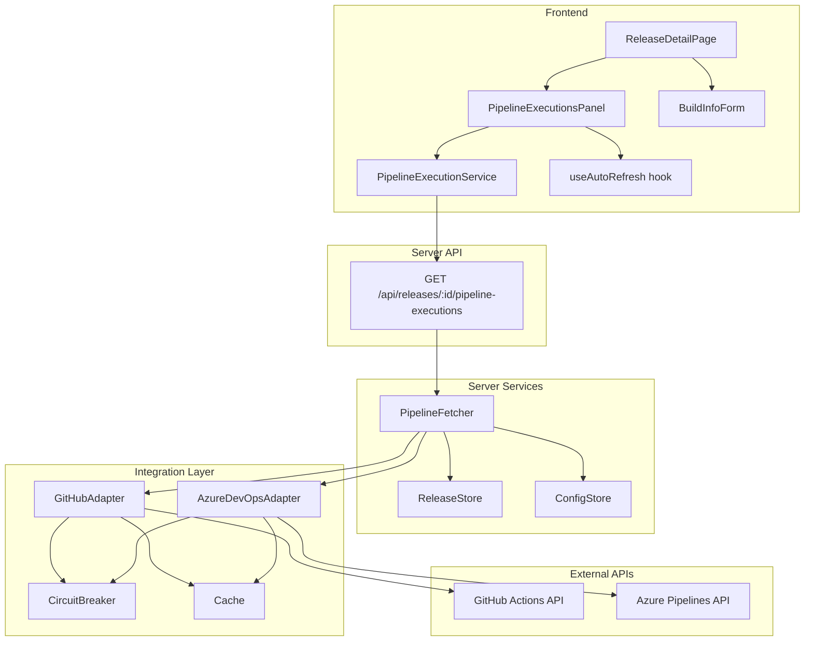

# Design Document: CI Pipeline Auto-Fetch

## Overview

This feature adds automatic retrieval and display of CI pipeline executions (GitHub Actions workflow runs and Azure Pipelines builds) on the release detail page. When a release is associated with a Repository Configuration that includes a `ciPipelineId`, the system fetches pipeline executions from the appropriate CI provider and displays them in a new panel, reducing manual build-number entry.

The design extends the existing adapter pattern (GitHubAdapter, AzureDevOpsAdapter) with new methods for fetching pipeline executions, introduces a `PipelineFetcher` service that orchestrates adapter selection and caching, exposes a new REST endpoint, and adds a React component (`PipelineExecutionsPanel`) to the release detail page.

## Architecture



The architecture follows the existing layered pattern:

1. **Integration Layer**: GitHubAdapter and AzureDevOpsAdapter gain `getWorkflowRuns` / `getPipelineBuilds` methods that return `CIExecution[]`. Results are cached for 5 minutes using the existing `Cache` with `TTL_5_MINUTES`.
2. **Service Layer**: `PipelineFetcher` resolves the release → config → adapter chain, delegates to the correct adapter, sorts results, and enforces the 50-record limit.
3. **API Layer**: A new GET endpoint on the releases router returns `CIExecution[]` or an error.
4. **Frontend**: `PipelineExecutionService` calls the endpoint. `PipelineExecutionsPanel` renders the data with status badges, auto-refreshes every 60 seconds, and supports manual refresh. `BuildInfoForm` shows an informational notice when auto-fetch is active.

## Components and Interfaces

### Server-Side

#### CIExecution (shared type in `domain/types.ts`)

```typescript
export interface CIExecution {
  id: string;
  runNumber: string;
  status: 'pending' | 'running' | 'passed' | 'failed';
  branch: string;
  commitSha: string;
  startedAt: string;       // ISO 8601
  completedAt?: string;    // ISO 8601
}
```

#### GitHubAdapter — new method

```typescript
async getWorkflowRuns(
  repository: string,
  workflowId: string
): Promise<Result<CIExecution[], IntegrationError>>
```

- Calls `GET /repos/{owner}/{repo}/actions/workflows/{workflowId}/runs`
- Maps GitHub run status/conclusion → `CIExecution.status`
- Caches under key `github:workflowRuns:{repository}:{workflowId}` with 5-minute TTL
- Uses existing `retryWithBackoff` and circuit breaker

#### AzureDevOpsAdapter — new method

```typescript
async getPipelineBuilds(
  pipelineId: string
): Promise<Result<CIExecution[], IntegrationError>>
```

- Calls the Azure Pipelines builds API filtered by `definitions={pipelineId}` with no branch filter
- Maps Azure build status/result → `CIExecution.status`
- Caches under key `azure:pipelineBuilds:{pipelineId}` with 5-minute TTL
- Uses existing `retryWithBackoff` and circuit breaker

#### PipelineFetcher (new service in `services/pipeline-fetcher.ts`)

```typescript
export class PipelineFetcher {
  constructor(
    private releaseStore: ReleaseStore,
    private configStore: ConfigStore,
    private githubAdapter: GitHubAdapter,
    private azureAdapter: AzureDevOpsAdapter
  ) {}

  async getExecutions(releaseId: string): Promise<Result<CIExecution[], ApplicationError>>
}
```

Logic:
1. Load release by ID → fail with NotFoundError if missing
2. Read `repositoryConfigId` from release → return `[]` if absent
3. Load RepositoryConfig by ID → return `[]` if config missing or `ciPipelineId` absent
4. Select adapter based on `sourceType` (`github` → GitHubAdapter, `azure` → AzureDevOpsAdapter)
5. Call adapter method with `ciPipelineId` (and `repositoryUrl` for GitHub)
6. Sort results by `startedAt` descending
7. Limit to 50 records
8. Wrap adapter `IntegrationError` as a 502-appropriate error

#### API Endpoint (added to `routes/releases.ts`)

```
GET /api/releases/:id/pipeline-executions
```

Response (200):
```json
{ "executions": [ /* CIExecution[] */ ] }
```

Error (502):
```json
{ "error": "Integration Error", "message": "..." }
```

Empty (200 — no config or no ciPipelineId):
```json
{ "executions": [] }
```

### Frontend

#### PipelineExecutionService (new in `services/PipelineExecutionService.ts`)

```typescript
export class PipelineExecutionService {
  constructor(private apiClient: APIClient) {}

  async getExecutions(releaseId: string): Promise<CIExecution[]>
}
```

Registered in `ServicesContext` alongside existing services.

#### usePipelineExecutions hook (new in `hooks/usePipelineExecutions.ts`)

```typescript
export function usePipelineExecutions(
  releaseId: string,
  service: PipelineExecutionService,
  hasCiPipeline: boolean
): {
  executions: CIExecution[];
  isLoading: boolean;
  isRefreshing: boolean;
  error: Error | null;
  refresh: () => void;
}
```

- Fetches on mount if `hasCiPipeline` is true
- Uses `useAutoRefresh` with 60-second interval
- Tracks `isRefreshing` separately from initial `isLoading`

#### PipelineExecutionsPanel (new component)

- Renders a table/list of CI executions: run number, status badge, branch, truncated commit SHA (7 chars), started-at timestamp
- Status badge colors: pending=gray, running=blue, passed=green, failed=red
- Shows loading spinner on initial load
- Shows error message with retry button on failure
- Shows subtle refresh indicator during background refreshes
- Not rendered when `hasCiPipeline` is false

#### BuildInfoForm modifications

- Accepts new prop `hasCiPipeline: boolean`
- When `true`, displays an informational notice: "Build information is being auto-fetched from the CI pipeline."
- Form remains visible and editable regardless


## Data Models

### CIExecution

| Field        | Type                                        | Description                                |
|-------------|---------------------------------------------|--------------------------------------------|
| id          | `string`                                    | Unique identifier from the CI provider     |
| runNumber   | `string`                                    | Human-readable run/build number            |
| status      | `'pending' \| 'running' \| 'passed' \| 'failed'` | Normalized execution status          |
| branch      | `string`                                    | Source branch name                         |
| commitSha   | `string`                                    | Full commit SHA from the CI provider       |
| startedAt   | `string` (ISO 8601)                         | When the execution started                 |
| completedAt | `string \| undefined` (ISO 8601)            | When the execution completed (if finished) |

### Release (extended)

The existing `Release` type gains an optional field:

| Field               | Type                  | Description                                      |
|--------------------|-----------------------|--------------------------------------------------|
| repositoryConfigId | `string \| undefined` | References the RepositoryConfig used to create it |

This field is set at release creation time when a RepositoryConfig is selected. The `ReleaseConfiguration` type also gains this optional field so it can be passed during creation.

### RepositoryConfig (unchanged)

Already contains `ciPipelineId?: string`, `sourceType`, and `repositoryUrl` — no changes needed.

### GitHub Status Mapping

| GitHub `status` | GitHub `conclusion` | → `CIExecution.status` |
|----------------|--------------------|-----------------------|
| `queued`       | —                  | `pending`             |
| `in_progress`  | —                  | `running`             |
| `completed`    | `success`          | `passed`              |
| `completed`    | `failure`          | `failed`              |
| `completed`    | `cancelled`        | `failed`              |
| `completed`    | `timed_out`        | `failed`              |
| `completed`    | other              | `failed`              |

### Azure Build Status Mapping

| Azure `status`  | Azure `result`     | → `CIExecution.status` |
|----------------|--------------------|-----------------------|
| `notStarted`   | —                  | `pending`             |
| `inProgress`   | —                  | `running`             |
| `completed`    | `succeeded`        | `passed`              |
| `completed`    | `failed`           | `failed`              |
| `completed`    | `canceled`         | `failed`              |
| `completed`    | `partiallySucceeded` | `failed`            |
| `completed`    | other              | `failed`              |

### Cache Keys

| Key Pattern                                          | TTL       | Description                    |
|-----------------------------------------------------|-----------|--------------------------------|
| `github:workflowRuns:{repository}:{workflowId}`    | 5 minutes | GitHub workflow runs            |
| `azure:pipelineBuilds:{pipelineId}`                 | 5 minutes | Azure pipeline builds           |


## Correctness Properties

*A property is a characteristic or behavior that should hold true across all valid executions of a system — essentially, a formal statement about what the system should do. Properties serve as the bridge between human-readable specifications and machine-verifiable correctness guarantees.*

### Property 1: GitHub workflow run mapping produces valid CIExecution

*For any* valid GitHub Actions workflow run API response object (with any combination of `status` and `conclusion` values), the mapping function shall produce a `CIExecution` with all required fields populated: a non-empty `id`, a non-empty `runNumber`, a `status` that is one of `pending | running | passed | failed`, a non-empty `branch`, a non-empty `commitSha`, and a valid ISO 8601 `startedAt` timestamp.

**Validates: Requirements 1.2**

### Property 2: Azure build mapping produces valid CIExecution

*For any* valid Azure Pipelines build API response object (with any combination of `status` and `result` values), the mapping function shall produce a `CIExecution` with all required fields populated: a non-empty `id`, a non-empty `runNumber`, a `status` that is one of `pending | running | passed | failed`, a non-empty `branch`, a non-empty `commitSha`, and a valid ISO 8601 `startedAt` timestamp.

**Validates: Requirements 2.2**

### Property 3: Adapter selection matches sourceType

*For any* release with a valid `repositoryConfigId` pointing to a `RepositoryConfig` that has a `ciPipelineId`, the `PipelineFetcher` shall select the `GitHubAdapter` when `sourceType` is `"github"` and the `AzureDevOpsAdapter` when `sourceType` is `"azure"`, and shall invoke the selected adapter's pipeline execution method with the correct `ciPipelineId`.

**Validates: Requirements 3.2**

### Property 4: Missing config or missing ciPipelineId returns empty list

*For any* release that either has no `repositoryConfigId`, or whose associated `RepositoryConfig` has no `ciPipelineId`, the `PipelineFetcher.getExecutions()` shall return a successful result containing an empty array.

**Validates: Requirements 3.3**

### Property 5: Executions are sorted descending by startedAt and limited to 50

*For any* list of `CIExecution` records returned by the pipeline executions endpoint, the list length shall be at most 50, and for every consecutive pair of records `(executions[i], executions[i+1])`, `executions[i].startedAt >= executions[i+1].startedAt`.

**Validates: Requirements 3.5, 3.6**

### Property 6: Rendered CIExecution contains all required fields with correct status color

*For any* `CIExecution` object, the rendered `PipelineExecutionsPanel` row shall contain: the `runNumber`, the `branch`, the first 7 characters of `commitSha`, the `startedAt` timestamp, and a status badge element whose CSS class corresponds to the execution's status (`pending` → gray, `running` → blue, `passed` → green, `failed` → red).

**Validates: Requirements 4.1, 4.2**

### Property 7: Release repositoryConfigId round trip

*For any* release created with a `repositoryConfigId`, retrieving that release by ID shall return a release object whose `repositoryConfigId` equals the value provided at creation time.

**Validates: Requirements 7.2**

### Property 8: Adapter errors are wrapped as IntegrationError

*For any* error response from a CI provider API (GitHub or Azure), the corresponding adapter method shall return a `Failure` containing an `IntegrationError` with a non-empty message string.

**Validates: Requirements 1.4, 2.4**

## Error Handling

### Server-Side Errors

| Scenario                                  | Handling                                                                                     |
|------------------------------------------|----------------------------------------------------------------------------------------------|
| Release not found                        | `PipelineFetcher` returns `Failure(NotFoundError)` → API responds 404                        |
| RepositoryConfig not found               | `PipelineFetcher` returns `Success([])` (graceful degradation)                               |
| No `ciPipelineId` on config              | `PipelineFetcher` returns `Success([])` (graceful degradation)                               |
| GitHub/Azure API error                   | Adapter returns `Failure(IntegrationError)` → `PipelineFetcher` propagates → API responds 502 |
| GitHub/Azure API timeout                 | Handled by existing `retryWithBackoff` in adapters; after retries exhausted → IntegrationError |
| Circuit breaker open                     | Adapter returns cached fallback or fails fast → IntegrationError                              |
| Invalid `sourceType` value               | `PipelineFetcher` returns `Failure(ValidationError)` → API responds 400                      |

### Frontend Errors

| Scenario                    | Handling                                                                 |
|----------------------------|--------------------------------------------------------------------------|
| API returns 502            | `usePipelineExecutions` sets `error` state → panel shows error + retry   |
| API returns 404            | `usePipelineExecutions` sets `error` state → panel shows error + retry   |
| Network failure            | Axios retry interceptor retries up to 3 times → then sets error state    |
| Refresh failure            | Previous data remains visible; subtle error indicator shown              |
| API returns empty array    | Panel shows "No pipeline executions found" empty state                   |

## Testing Strategy

### Property-Based Testing

The project uses **fast-check** (already a dependency in `packages/web`) with **Jest** as the test runner. `fast-check` should also be added as a dev dependency in `packages/server` for server-side property tests.

Each property test must:
- Run a minimum of **100 iterations**
- Reference its design property with a tag comment: `// Feature: ci-pipeline-auto-fetch, Property {N}: {title}`
- Use `fc.assert(fc.property(...))` pattern

Property tests to implement:

1. **Property 1 — GitHub mapping**: Generate random GitHub run objects with arbitrary `status`/`conclusion` combinations. Assert the mapping always produces a valid `CIExecution`.
2. **Property 2 — Azure mapping**: Generate random Azure build objects with arbitrary `status`/`result` combinations. Assert the mapping always produces a valid `CIExecution`.
3. **Property 3 — Adapter selection**: Generate random `RepositoryConfig` objects with `sourceType` of `"github"` or `"azure"`. Mock both adapters. Assert the correct adapter is called.
4. **Property 4 — Missing config empty list**: Generate random releases with no `repositoryConfigId` or configs with no `ciPipelineId`. Assert result is `Success([])`.
5. **Property 5 — Sorting and limit**: Generate random arrays of 0–100 `CIExecution` objects. Pass through the sorting/limiting logic. Assert output is sorted descending by `startedAt` and length ≤ 50.
6. **Property 6 — Rendered fields**: Generate random `CIExecution` objects. Render the panel row. Assert the DOM contains all required fields and correct status CSS class.
7. **Property 7 — repositoryConfigId round trip**: Generate random release configs with `repositoryConfigId`. Create and retrieve. Assert the field matches.
8. **Property 8 — Error wrapping**: Generate random error messages/codes. Pass through adapter error handling. Assert result is `Failure(IntegrationError)` with non-empty message.

### Unit Tests

Unit tests complement property tests for specific examples and edge cases:

- **Caching**: Verify that a second call within 5 minutes returns cached data (mock timer)
- **Status mapping edge cases**: Verify specific GitHub/Azure status combinations (e.g., `completed` + `cancelled` → `failed`)
- **Empty response**: Verify adapter handles empty workflow runs / builds array
- **Panel conditional rendering**: Verify panel is not rendered when `hasCiPipeline` is false
- **Loading state**: Verify loading indicator appears during fetch
- **Error + retry**: Verify error message and retry button appear on API error
- **Auto-refresh interval**: Verify `useAutoRefresh` is called with 60000ms interval
- **BuildInfoForm notice**: Verify notice appears when `hasCiPipeline` is true, absent when false
- **Commit SHA truncation**: Verify `commitSha` is displayed as first 7 characters
- **502 error propagation**: Verify API returns 502 when adapter fails
