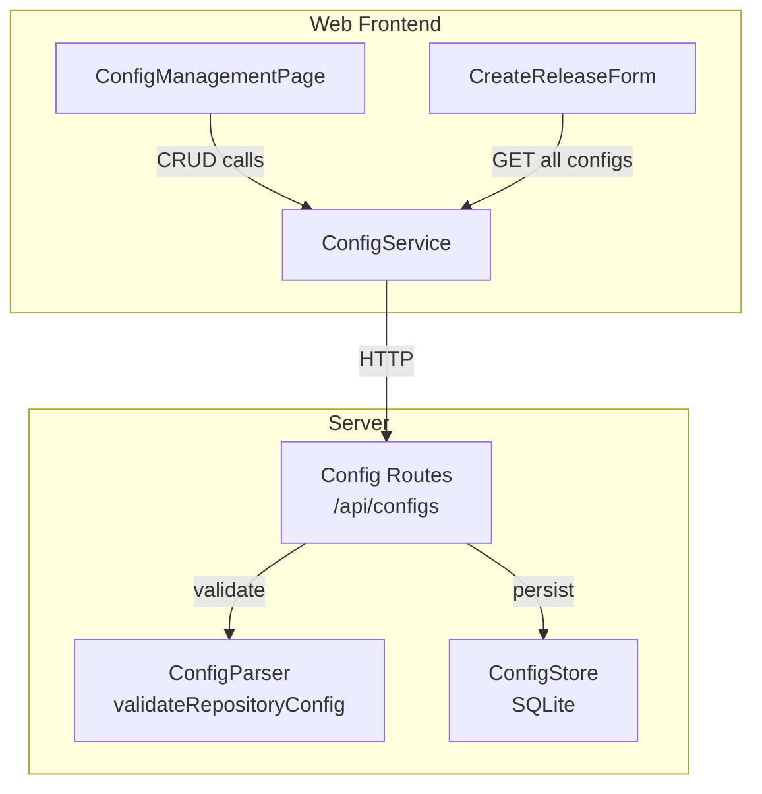

# Design Document: Global Repository Configuration

## Overview

The Global Repository Configuration feature adds the ability to define and manage named repository-level default settings that can be reused when creating releases. Instead of manually entering repository URL, source type, squads, quality thresholds, and rollout stages every time, a Release Manager creates a `RepositoryConfig` once and selects it from a dropdown during release creation.

The feature spans three layers:
1. **Server**: New `RepositoryConfig` domain type, a `ConfigStore` for SQLite persistence, validation logic in the existing `ConfigParser`, and CRUD REST endpoints under `/api/configs`
2. **Web frontend**: A new `ConfigService` for API calls, a `ConfigManagementPage` for CRUD operations, and modifications to `CreateReleaseForm` to add a config selector dropdown
3. **Shared validation**: The existing `ConfigParser` is extended with `RepositoryConfig`-specific validation (name length, URL format, source type enum, thresholds range, rollout stages range, squads non-empty)

### Key Design Decisions

- **Reuse existing patterns**: The new store, routes, and service follow the same `Result<T, E>` / `ApplicationError` patterns used by `ReleaseStore` and release routes
- **Extend ConfigParser rather than create a new parser**: The existing `JSONConfigParser` already validates most of the overlapping fields (URL, sourceType, squads, thresholds, rolloutStages). A new `validateRepositoryConfig` method is added alongside the existing `validate` method
- **SQLite storage with unique name constraint**: Configs are stored in a new `repository_configs` table with a UNIQUE constraint on `name` to enforce uniqueness at the database level
- **`fast-check` for property-based testing**: Already available in the monorepo's `node_modules`

## Architecture



### Data Flow

1. **Create config**: `ConfigManagementPage` → `ConfigService.create()` → `POST /api/configs` → `ConfigParser.validateRepositoryConfig()` → `ConfigStore.create()` → return created record
2. **Auto-populate form**: `CreateReleaseForm` mounts → `ConfigService.getAll()` → `GET /api/configs` → populate dropdown → user selects config → form fields filled with config values
3. **Update/Delete**: Same pattern through `ConfigService` → routes → store

## Components and Interfaces

### Server-Side

#### RepositoryConfig Type (`packages/server/src/domain/types.ts`)

```typescript
export interface RepositoryConfig {
  id: string;
  name: string;
  repositoryUrl: string;
  sourceType: SourceType;
  requiredSquads: string[];
  qualityThresholds: {
    crashRateThreshold: number;
    cpuExceptionRateThreshold: number;
  };
  rolloutStages: number[];
  ciPipelineId?: string;
  analyticsProjectId?: string;
  createdAt: Date;
  updatedAt: Date;
}
```

#### ConfigStore (`packages/server/src/data/config-store.ts`)

```typescript
export class ConfigStore {
  create(config: Omit<RepositoryConfig, 'id' | 'createdAt' | 'updatedAt'>): Promise<Result<RepositoryConfig, ApplicationError>>;
  getAll(): Promise<Result<RepositoryConfig[], ApplicationError>>;
  getById(id: string): Promise<Result<RepositoryConfig, ApplicationError>>;
  update(id: string, updates: Partial<Omit<RepositoryConfig, 'id' | 'createdAt' | 'updatedAt'>>): Promise<Result<RepositoryConfig, ApplicationError>>;
  delete(id: string): Promise<Result<void, ApplicationError>>;
}
```

Internally uses an in-memory `Map<string, RepositoryConfig>` (consistent with how `MockDataProvider` works in mock mode) with unique name enforcement. For database mode, a `repository_configs` SQLite table is used.

#### ConfigParser Extension (`packages/server/src/application/config-parser.ts`)

Add to the existing `ConfigParser` interface:

```typescript
export interface ConfigParser {
  // ... existing methods
  parseRepositoryConfig(json: string): Result<RepositoryConfig, ParseError>;
  formatRepositoryConfig(config: RepositoryConfig): string;
  validateRepositoryConfig(config: Partial<RepositoryConfig>): ValidationResult;
}
```

Validation rules for `validateRepositoryConfig`:
- `name`: non-empty string, max 100 characters
- `repositoryUrl`: well-formed URL
- `sourceType`: `"github"` or `"azure"`
- `requiredSquads`: non-empty array of non-empty strings
- `crashRateThreshold` and `cpuExceptionRateThreshold`: numbers between 0 and 100
- `rolloutStages`: non-empty array of numbers between 0 and 100
- `ciPipelineId` (optional): non-empty string if provided
- `analyticsProjectId` (optional): non-empty string if provided

#### Config Routes (`packages/server/src/routes/configs.ts`)

| Method | Path | Description | Success | Error |
|--------|------|-------------|---------|-------|
| POST | `/api/configs` | Create config | 201 + config | 400 (validation), 409 (duplicate name) |
| GET | `/api/configs` | List all configs | 200 + configs[] | 500 |
| GET | `/api/configs/:id` | Get config by ID | 200 + config | 404 |
| PUT | `/api/configs/:id` | Update config | 200 + config | 400, 404, 409 |
| DELETE | `/api/configs/:id` | Delete config | 200 + success | 404 |

### Web Frontend

#### RepositoryConfig Type (`packages/web/src/types/index.ts`)

```typescript
export interface RepositoryConfig {
  id: string;
  name: string;
  repositoryUrl: string;
  sourceType: 'github' | 'azure';
  requiredSquads: string[];
  qualityThresholds: QualityThresholds;
  rolloutStages: number[];
  ciPipelineId?: string;
  analyticsProjectId?: string;
  createdAt: string;
  updatedAt: string;
}
```

#### ConfigService (`packages/web/src/services/ConfigService.ts`)

```typescript
export class ConfigService {
  getAll(): Promise<RepositoryConfig[]>;
  getById(id: string): Promise<RepositoryConfig>;
  create(config: Omit<RepositoryConfig, 'id' | 'createdAt' | 'updatedAt'>): Promise<RepositoryConfig>;
  update(id: string, config: Partial<RepositoryConfig>): Promise<RepositoryConfig>;
  delete(id: string): Promise<void>;
}
```

#### ConfigManagementPage (`packages/web/src/pages/ConfigManagementPage.tsx`)

- Displays a table of all configs (name, repositoryUrl, sourceType)
- "Create New" button opens a form with all required/optional fields
- Edit button pre-fills the form with current values
- Delete button shows a confirmation dialog before deleting
- Success/error notifications via the existing `NotificationContext`

#### CreateReleaseForm Modifications

- Add a `<select>` dropdown at the top of the form listing all `RepositoryConfig` records by name, plus a "None" option
- On selection, call `setValue()` from `react-hook-form` to populate: `repositoryUrl`, `sourceType`, `requiredSquads`, `crashRateThreshold`, `cpuExceptionRateThreshold`, `rolloutStages`
- All auto-populated fields remain editable (user can override)
- When "None" is selected, form behaves as it does today

## Data Models

### SQLite Schema Addition

```sql
CREATE TABLE IF NOT EXISTS repository_configs (
  id VARCHAR(255) PRIMARY KEY,
  name VARCHAR(100) NOT NULL UNIQUE,
  repository_url TEXT NOT NULL,
  source_type VARCHAR(20) NOT NULL,
  required_squads TEXT NOT NULL,        -- JSON array
  quality_thresholds TEXT NOT NULL,     -- JSON object
  rollout_stages TEXT NOT NULL,         -- JSON array
  ci_pipeline_id VARCHAR(255),
  analytics_project_id VARCHAR(255),
  created_at TIMESTAMP NOT NULL,
  updated_at TIMESTAMP NOT NULL
);
```

JSON columns (`required_squads`, `quality_thresholds`, `rollout_stages`) are serialized/deserialized by the `ConfigStore` using `JSON.stringify`/`JSON.parse`.


## Correctness Properties

*A property is a characteristic or behavior that should hold true across all valid executions of a system — essentially, a formal statement about what the system should do. Properties serve as the bridge between human-readable specifications and machine-verifiable correctness guarantees.*

### Property 1: Create-retrieve round trip

*For any* valid RepositoryConfig data (with a unique name), creating it via the ConfigStore and then retrieving it by the returned ID should produce a record whose fields match the original input.

**Validates: Requirements 1.2, 2.2**

### Property 2: Unique name enforcement

*For any* two RepositoryConfig records, attempting to create or update a config so that its name matches an existing config's name should result in a conflict error, and the store should remain unchanged.

**Validates: Requirements 1.3, 3.3**

### Property 3: Validation accepts valid configs and rejects invalid ones

*For any* RepositoryConfig object, `validateRepositoryConfig` should return valid=true if and only if: the name is a non-empty string of at most 100 characters, the repositoryUrl is a well-formed URL, the sourceType is "github" or "azure", requiredSquads is a non-empty array of non-empty strings, crashRateThreshold and cpuExceptionRateThreshold are numbers in [0, 100], rolloutStages is a non-empty array of numbers in [0, 100], and optional fields (if present) are non-empty strings.

**Validates: Requirements 1.5, 3.5, 7.1, 7.2, 7.3, 7.4, 7.5, 7.6**

### Property 4: Get all returns all created configs

*For any* sequence of created RepositoryConfig records, calling getAll should return a list containing every created config and no others.

**Validates: Requirements 2.1**

### Property 5: Update persists changes

*For any* existing RepositoryConfig and any valid partial update, applying the update and then retrieving the config should return a record reflecting the updated fields while preserving unchanged fields.

**Validates: Requirements 3.2**

### Property 6: Delete removes config

*For any* existing RepositoryConfig, deleting it should succeed, and a subsequent getById should return a not-found error.

**Validates: Requirements 4.2**

### Property 7: Form auto-population from config

*For any* RepositoryConfig (with or without optional fields), selecting it in the CreateReleaseForm should populate repositoryUrl, sourceType, requiredSquads, crashRateThreshold, cpuExceptionRateThreshold, rolloutStages, and any present optional fields (ciPipelineId, analyticsProjectId) with the config's values.

**Validates: Requirements 5.2, 5.3, 5.4**

### Property 8: Config list displays all configs

*For any* set of RepositoryConfig records, the ConfigManagementPage list should render a row for each config showing its name, repositoryUrl, and sourceType.

**Validates: Requirements 6.1**

### Property 9: Edit form pre-fills current values

*For any* RepositoryConfig, clicking edit should display a form where every field's value matches the config's current stored value.

**Validates: Requirements 6.3**

### Property 10: Parse/format round trip

*For any* valid RepositoryConfig object, `parseRepositoryConfig(formatRepositoryConfig(config))` should produce an object equivalent to the original config.

**Validates: Requirements 8.1, 8.3, 8.4**

## Error Handling

| Scenario | HTTP Status | Error Type | Response Body |
|----------|-------------|------------|---------------|
| Validation failure (create/update) | 400 | `ValidationError` | `{ error: "Validation Error", message: "...", errors: [...] }` |
| Duplicate config name | 409 | `ConflictError` | `{ error: "Conflict", message: "Configuration name '...' is already in use" }` |
| Config not found (get/update/delete) | 404 | `NotFoundError` | `{ error: "Not Found", message: "Repository configuration ... not found" }` |
| Invalid JSON body | 400 | `ParseError` | `{ error: "Validation Error", message: "Failed to parse request body" }` |
| Internal server error | 500 | `ApplicationError` | `{ error: "Internal Server Error", message: "..." }` |

The existing `errorHandler` middleware already handles `ValidationError`, `NotFoundError`, and `ApplicationError`. A `ConflictError` handler needs to be added to return 409 status codes.

## Testing Strategy

### Unit Tests

- **ConfigStore**: Test create, getAll, getById, update, delete operations with specific examples. Test edge cases: empty store returns empty list, delete non-existent ID returns not-found, duplicate name returns conflict error.
- **Config Routes**: Test each endpoint with mocked ConfigStore. Verify correct HTTP status codes and response shapes. Test error paths (400, 404, 409).
- **ConfigManagementPage**: Test rendering of config list, form submission, edit pre-fill, delete confirmation dialog, success/error notifications.
- **CreateReleaseForm**: Test that selecting a config populates fields, selecting "None" resets to defaults, fields remain editable after auto-population.

### Property-Based Tests

Use `fast-check` for property-based testing. Each property test must run a minimum of 100 iterations.

- **Property 1** (Create-retrieve round trip): Generate random valid RepositoryConfig objects, create them, retrieve by ID, assert equality. Tag: `Feature: global-repo-config, Property 1: Create-retrieve round trip`
- **Property 2** (Unique name enforcement): Generate two configs with the same name, assert second create fails. Tag: `Feature: global-repo-config, Property 2: Unique name enforcement`
- **Property 3** (Validation): Generate both valid and invalid configs, assert validateRepositoryConfig returns correct valid/invalid status. Tag: `Feature: global-repo-config, Property 3: Validation accepts valid configs and rejects invalid ones`
- **Property 4** (Get all): Generate N configs, create all, assert getAll returns exactly N. Tag: `Feature: global-repo-config, Property 4: Get all returns all created configs`
- **Property 5** (Update persists): Generate a config and a valid partial update, apply update, assert fields changed. Tag: `Feature: global-repo-config, Property 5: Update persists changes`
- **Property 6** (Delete removes): Generate a config, create it, delete it, assert getById fails. Tag: `Feature: global-repo-config, Property 6: Delete removes config`
- **Property 10** (Parse/format round trip): Generate valid RepositoryConfig objects, format to JSON, parse back, assert equivalence. Tag: `Feature: global-repo-config, Property 10: Parse/format round trip`

Properties 7, 8, and 9 are UI-level properties that will be covered by unit tests with specific examples rather than property-based tests, since they require DOM rendering and are better suited to React Testing Library assertions.
