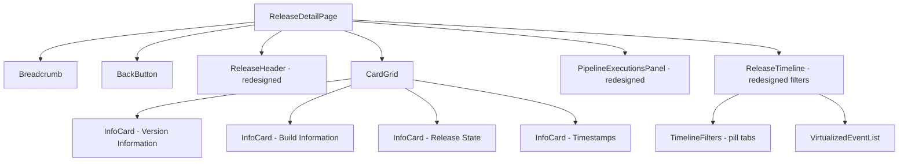
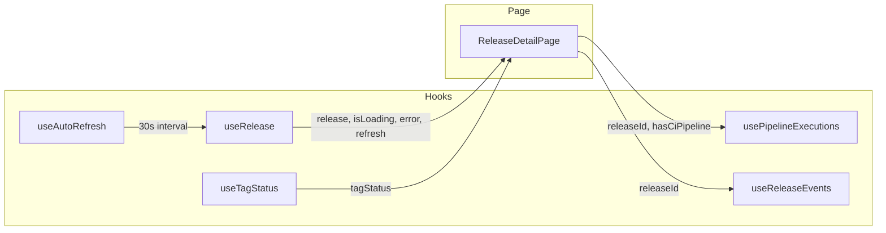

# Design Document: Release Detail Page Redesign

## Overview

This design specifies the redesign of the `ReleaseDetailPage` component to match a card-based layout with improved visual hierarchy. The current page renders release information in vertically stacked sections. The redesign reorganizes this into:

1. Breadcrumb navigation and back button (existing components, unchanged)
2. A header row with release title, status badge, and refresh button
3. Four information cards in a single horizontal row (Version Information, Build Information, Release State, Timestamps)
4. A Pipeline Executions section with a redesigned table (Action Name, Status with icons, Duration, Started At)
5. A Timeline section with pill-style filter tabs

The redesign is primarily a UI restructuring. The data layer (`useRelease`, `useTagStatus`, `usePipelineExecutions`, `useReleaseEvents`) remains unchanged. The changes are confined to the page component, the `ReleaseInfo` component (split into four card sub-components), the `PipelineExecutionsPanel` table columns, and the `TimelineFilters` styling.

## Architecture

### Component Hierarchy



### Data Flow



No new hooks are introduced. The existing hooks provide all necessary data. The redesign only changes how data is rendered.

### Styling Approach

All components use CSS Modules (`.module.css` files), consistent with the existing codebase. No CSS framework or utility-class library is introduced.

## Components and Interfaces

### 1. ReleaseDetailPage (redesigned)

**File:** `packages/web/src/pages/ReleaseDetailPage.tsx`

The page component orchestrates data fetching and renders the layout. The redesign removes `StageControl`, `TagDetectionStatus`, and `ReleaseInfo` from the render tree and replaces them with the new `CardGrid` containing four `InfoCard` components.

```typescript
// No interface changes — same props/hooks as current implementation
// Structural changes only:
// - Remove: <ReleaseInfo>, <TagDetectionStatus>, <StageControl>
// - Add: <CardGrid> with four <InfoCard> children
// - Keep: <Breadcrumb>, <BackButton>, <ReleaseHeader>, <PipelineExecutionsPanel>, <ReleaseTimeline>
```

### 2. ReleaseHeader (redesigned)

**File:** `packages/web/src/components/ReleaseHeader.tsx`

No interface change. The component already renders `{platform} {version}` as an h1 with a status badge. The CSS module is updated so the status badge uses a green background for "Upcoming" to match the screenshot (currently blue).

**CSS changes to `ReleaseHeader.module.css`:**
- `.status-upcoming`: Change from blue (`#e3f2fd`/`#1976d2`) to green (`#e8f5e9`/`#388e3c`)

### 3. InfoCard (new component)

**File:** `packages/web/src/components/InfoCard.tsx` + `InfoCard.module.css`

A generic card component that renders a titled card with label-value field pairs.

```typescript
interface InfoCardField {
  label: string;
  value: string | null;
  href?: string;        // If provided, value renders as <a> link
  fallback?: string;    // Displayed when value is null (default: "N/A")
}

interface InfoCardProps {
  title: string;
  fields: InfoCardField[];
}
```

**Styling:** Bordered card (`1px solid #e0e0e0`), `border-radius: 0.5rem`, white background, `padding: 1.5rem`. Title is bold, `font-size: 1rem`, `margin-bottom: 1rem`. Fields render as a vertical list of label-value rows. Labels are `color: #666`, `font-size: 0.875rem`. Values are `color: #1a1a1a`, `font-size: 0.875rem`. Links are `color: #1976d2`.

### 4. CardGrid (new component)

**File:** `packages/web/src/components/CardGrid.tsx` + `CardGrid.module.css`

A layout component that arranges its children in a responsive grid.

```typescript
interface CardGridProps {
  children: React.ReactNode;
}
```

**CSS:**
- `>1024px`: `grid-template-columns: repeat(4, 1fr)` — four equal columns
- `769px–1024px`: `grid-template-columns: repeat(2, 1fr)` — two columns
- `≤768px`: `grid-template-columns: 1fr` — single column stack
- `gap: 1rem`

### 5. PipelineExecutionsPanel (redesigned)

**File:** `packages/web/src/components/PipelineExecutionsPanel.tsx`

The table columns change from `[Run #, Status, Branch, Commit, Started At]` to `[Action Name, Status, Duration, Started At]`.

**Status column:** Renders a green checkmark circle icon (`✅`) + "Success" text for `passed` status, and a red X circle icon (`❌`) + "Failure" text for `failed` status. For `pending`/`running`, existing badge styling is retained.

**Duration column:** Computed from `startedAt` and `completedAt` fields on `CIExecution`. If `completedAt` is undefined, display "In progress".

**Action Name column:** Maps `CIExecution` data. Since the current `CIExecution` type does not have an `actionName` field, we use `runNumber` as the display value (or the URL link text). The column header changes to "Action Name".

**No interface changes** to the component props. Internal rendering logic changes only.

### 6. TimelineFilters (redesigned styling)

**File:** `packages/web/src/components/TimelineFilters.module.css`

The filter buttons are restyled as pill/chip buttons:
- Default state: `border: 1px solid #e0e0e0`, `border-radius: 9999px`, `padding: 0.375rem 0.875rem`, `background: white`, `color: #333`
- Active/selected state: `border-color: #4caf50`, `color: #4caf50`, `background: #f1f8e9`
- The "All Events" tab, when selected (no filters active), gets the green active style

No changes to the component's TypeScript interface or logic. Styling-only changes.

### 7. ReleaseTimeline (minor redesign)

**File:** `packages/web/src/components/ReleaseTimeline.tsx`

The container gets a bordered card wrapper matching the Pipeline Executions section. The inline refresh button is removed from the timeline header (the page-level refresh handles it). The section title "Timeline" remains.

**CSS changes to `ReleaseTimeline.module.css`:**
- `.container`: Add `border: 1px solid #e0e0e0`, `border-radius: 0.5rem`, `padding: 1.5rem`, `background: white`

## Data Models

### Existing Types (unchanged)

| Type | Source | Usage |
|------|--------|-------|
| `Release` | `packages/web/src/types/index.ts` | All four info cards |
| `CIExecution` | `packages/web/src/types/index.ts` | Pipeline executions table |
| `ReleaseEvent` (union) | `packages/web/src/types/releaseEvent.ts` | Timeline section |
| `EventType` | `packages/web/src/types/releaseEvent.ts` | Timeline filter tabs |

### New Types

| Type | File | Purpose |
|------|------|---------|
| `InfoCardField` | `packages/web/src/components/InfoCard.tsx` | Describes a label-value pair for the InfoCard |
| `InfoCardProps` | `packages/web/src/components/InfoCard.tsx` | Props for the InfoCard component |
| `CardGridProps` | `packages/web/src/components/CardGrid.tsx` | Props for the CardGrid layout component |

### Data Mapping (Release → Cards)

| Card | Fields | Source on `Release` |
|------|--------|---------------------|
| Version Information | Version, Branch, Repository, Source Type | `version`, `branchName`, `repositoryUrl`, `sourceType` |
| Build Information | Latest Build, Latest Passing Build, Latest App Store Build | `latestBuild`, `latestPassingBuild`, `latestAppStoreBuild` |
| Release State | Current Stage, Status, Rollout Percentage | `currentStage`, `status`, `rolloutPercentage` |
| Timestamps | Created, Last Updated, Last Synced | `createdAt`, `updatedAt`, `lastSyncedAt` |

### Duration Computation

Pipeline execution duration is derived, not stored:
```typescript
function computeDuration(startedAt: string, completedAt?: string): string {
  if (!completedAt) return 'In progress';
  const ms = new Date(completedAt).getTime() - new Date(startedAt).getTime();
  const totalSeconds = Math.floor(ms / 1000);
  const minutes = Math.floor(totalSeconds / 60);
  const seconds = totalSeconds % 60;
  return `${minutes}m ${seconds}s`;
}
```


## Correctness Properties

*A property is a characteristic or behavior that should hold true across all valid executions of a system — essentially, a formal statement about what the system should do. Properties serve as the bridge between human-readable specifications and machine-verifiable correctness guarantees.*

### Property 1: Header renders correct title and status badge with distinct styling

*For any* release with a valid platform and version, the ReleaseHeader component shall render the text `{platform} {version}` as the heading content, display the release status as badge text, and apply a CSS class unique to that status value (i.e., different statuses produce different class names).

**Validates: Requirements 3.1, 3.2, 3.3**

### Property 2: Refresh button reflects refreshing state

*For any* boolean `isRefreshing` value, when `isRefreshing` is true the refresh button shall display the text "Refreshing..." and be disabled; when false it shall display "↻ Refresh" and be enabled.

**Validates: Requirements 3.6**

### Property 3: Version Information card displays all fields with repository as link

*For any* release, the Version Information card shall display four fields (Version, Branch, Repository, Source Type) where the Repository value is rendered as an anchor element with `target="_blank"` and `href` equal to `release.repositoryUrl`, and the remaining fields are rendered as plain text matching their corresponding release properties.

**Validates: Requirements 5.2, 5.3, 5.4**

### Property 4: Build Information card displays all fields with null fallback

*For any* release, the Build Information card shall display three fields (Latest Build, Latest Passing Build, Latest App Store Build). For each field, if the corresponding release property is null, the displayed value shall be "N/A"; otherwise it shall be the property value.

**Validates: Requirements 6.2, 6.3**

### Property 5: Release State card displays all fields with rollout as percentage

*For any* release, the Release State card shall display three fields (Current Stage, Status, Rollout Percentage) where the Rollout Percentage value is formatted as `{number}%` matching `release.rolloutPercentage`.

**Validates: Requirements 7.2, 7.3**

### Property 6: Timestamps card displays all fields in human-readable format

*For any* release with valid ISO 8601 timestamps, the Timestamps card shall display three fields (Created, Last Updated, Last Synced) where each non-null timestamp is formatted via `formatDate()` producing a non-empty string that is not "Invalid Date", and a null `lastSyncedAt` displays "N/A".

**Validates: Requirements 8.2, 8.3, 8.4**

### Property 7: Pipeline execution status maps to correct icon and label

*For any* CI execution, the Status column shall render a green checkmark icon with "Success" text when `status` is `passed`, and a red X icon with "Failure" text when `status` is `failed`.

**Validates: Requirements 9.3**

### Property 8: Timeline filter shows only matching events

*For any* set of release events and any selected event type filter, the displayed events shall be exactly those whose `type` matches the selected filter. When no filter is selected (All Events), all events shall be displayed.

**Validates: Requirements 10.3, 10.4**

### Property 9: Timeline events are ordered newest first

*For any* set of release events displayed in the timeline, the events shall be ordered by timestamp in descending order (newest first).

**Validates: Requirements 10.6**

### Property 10: Timeline entries contain icon, timestamp, and description

*For any* release event rendered in the timeline, the entry shall contain an event icon element, a timestamp element, and a description text element.

**Validates: Requirements 10.5**

## Error Handling

### Page-Level Error States

| State | Trigger | Behavior |
|-------|---------|----------|
| Loading | `isLoading === true` | Render Breadcrumb + BackButton + "Loading release details..." message. No cards, no pipeline, no timeline. |
| Error | `error !== null` | Render Breadcrumb + BackButton + error message with `error.message` + "Retry" button. Retry calls `handleRefresh`. |
| Not Found | `release === null` after loading | Render Breadcrumb + BackButton + "Release Not Found" heading + descriptive text. |

### Component-Level Error Handling

- **PipelineExecutionsPanel**: Has its own loading/error/empty states. Error shows retry button. Empty shows "No pipeline executions found". When `hasCiPipeline` is false, component returns `null`.
- **ReleaseTimeline**: Wrapped in `ErrorBoundary`. Has its own loading/error/empty states via `TimelineError` and `TimelineEmptyState` components.
- **InfoCard**: Pure presentational — no error states. Null values handled via `fallback` prop (defaults to "N/A").
- **formatDate**: Returns "Invalid Date" for unparseable strings. The Timestamps card passes through whatever `formatDate` returns.

### Auto-Refresh Guard

Auto-refresh is disabled when `isLoading` or `error` is truthy, preventing refresh loops during error states. Implemented via `useAutoRefresh(refresh, { interval: 30000, enabled: !isLoading && !error })`.

## Testing Strategy

### Property-Based Testing

Use `fast-check` as the property-based testing library (already available in the project's test ecosystem with Vitest).

Each correctness property maps to a single property-based test with a minimum of 100 iterations. Tests are tagged with the format:

```
Feature: release-detail-redesign, Property {number}: {property_text}
```

**Property tests to implement:**

1. **Property 1** — Generate random `Release` objects (random platform from `['iOS', 'Android', 'Desktop']`, random version strings, random status from `['Upcoming', 'Current', 'Production']`). Render `ReleaseHeader`, assert heading text matches `{platform} {version}`, badge text matches status, and CSS class differs per status.

2. **Property 2** — Generate random boolean `isRefreshing`. Render the refresh button with that state. Assert text and disabled attribute match.

3. **Property 3** — Generate random `Release` objects. Build the `InfoCardField[]` array for Version Information. Assert four fields present, repository field has `href` set, other fields are plain text.

4. **Property 4** — Generate random `Release` objects where build fields are randomly null or string values. Build the Build Information fields. Assert three fields present, null values display "N/A".

5. **Property 5** — Generate random `Release` objects with random `rolloutPercentage` (0–100). Build Release State fields. Assert rollout field value matches `{number}%`.

6. **Property 6** — Generate random ISO 8601 date strings and random null/non-null `lastSyncedAt`. Assert `formatDate` output is valid, null shows "N/A".

7. **Property 7** — Generate random `CIExecution` objects with status `passed` or `failed`. Assert the status cell contains the correct icon and label text.

8. **Property 8** — Generate random arrays of `ReleaseEvent` objects with random types. Pick a random filter type. Assert filtered results all match the type. Assert empty filter returns all events.

9. **Property 9** — Generate random arrays of `ReleaseEvent` objects with random timestamps. Assert the displayed order is descending by timestamp.

10. **Property 10** — Generate random `ReleaseEvent` objects. Render `TimelineEvent`. Assert the output contains an icon element, a `<time>` element, and description text.

### Unit Tests (Example-Based)

Unit tests cover specific examples, edge cases, and integration points:

- Breadcrumb renders correct path for a known release ID (1.1)
- Breadcrumb terminal item is not a link (1.3)
- Back button displays "← Back to Releases" (2.1)
- Back button navigates to "/" on click (2.2)
- Card titles match expected strings: "Version Information", "Build Information", "Release State", "Timestamps" (5.1, 6.1, 7.1, 8.1)
- Pipeline table renders column headers: Action Name, Status, Duration, Started At (9.2)
- Pipeline empty state message when executions array is empty (9.4)
- Pipeline not rendered when `hasCiPipeline` is false (9.5)
- Pipeline loading indicator when `isLoading` is true (9.6)
- Timeline section title is "Timeline" (10.1)
- Timeline filter tabs render all nine labels (10.2)
- Timeline empty state when no events (10.7)
- Page loading state renders breadcrumb + back button + loading message (11.1)
- Page error state renders error message + retry button (11.2)
- Retry button triggers refresh (11.3)
- Release not found state (11.4)
- Auto-refresh configured with 30s interval (12.1)
- Auto-refresh disabled during loading (12.2)
- Auto-refresh disabled during error (12.3)

### Test Configuration

- Test runner: Vitest
- Property-based testing: `fast-check` with `fc.assert(fc.property(...), { numRuns: 100 })`
- Component rendering: `@testing-library/react`
- Each property test file tagged: `// Feature: release-detail-redesign, Property N: {title}`
