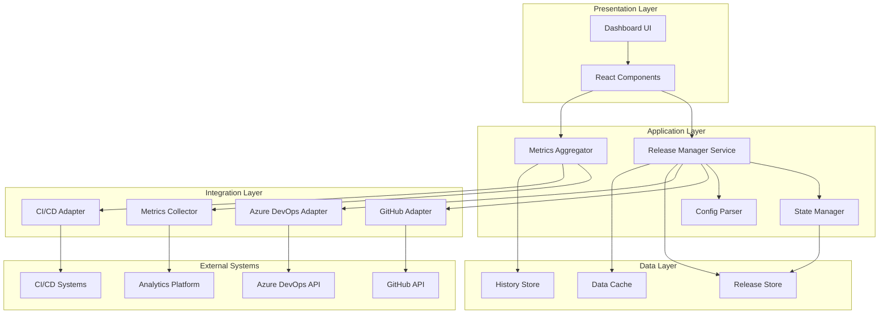

# Design Document: Release Manager Tool

## Overview

The Release Manager Tool is a real-time dashboard application that provides comprehensive visibility and control over software releases across multiple platforms (iOS, Android, Desktop). The system integrates with both GitHub and Azure DevOps to automatically retrieve release information, track quality metrics, manage blockers, and control rollout progression through a multi-stage release pipeline.

### Key Design Goals

1. **Real-time Visibility**: Provide up-to-date release status with maximum 60-second data refresh intervals
2. **Multi-Platform Support**: Handle concurrent releases across iOS, Android, and Desktop independently
3. **Dual Integration**: Support both GitHub and Azure DevOps as source control and CI/CD platforms
4. **Scalability**: Support at least 10 concurrent releases per platform
5. **Data Integrity**: Maintain consistent state across multiple data sources and prevent conflicts
6. **Extensibility**: Design for easy addition of new platforms, metrics, and integrations

### Architecture Philosophy

The design follows a layered architecture with clear separation of concerns:
- **Presentation Layer**: React-based dashboard with real-time updates
- **Application Layer**: Business logic for release management, state transitions, and validation
- **Integration Layer**: Adapters for GitHub and Azure DevOps APIs
- **Data Layer**: Persistent storage with historical tracking and caching for performance

## Architecture

### System Architecture



### Component Responsibilities

**Presentation Layer**
- Dashboard UI: Main interface for viewing and interacting with releases
- React Components: Reusable UI elements (status indicators, expandable sections, metric displays)

**Application Layer**
- Release Manager Service: Core business logic for release lifecycle management
- Metrics Aggregator: Collects and processes quality metrics, DAU, and rollout data
- State Manager: Handles release state transitions and validation
- Config Parser: Parses and validates release configuration files

**Integration Layer**
- GitHub Adapter: Interfaces with GitHub API for repository data
- Azure DevOps Adapter: Interfaces with Azure DevOps for repositories, pipelines, and work items
- CI/CD Adapter: Retrieves build information from continuous integration systems
- Metrics Collector: Gathers quality metrics from analytics platforms

**Data Layer**
- Release Store: Persistent storage for active release data
- History Store: Archives historical release information (90+ days)
- Cache: In-memory cache for frequently accessed data to reduce API calls

### Data Flow

1. **Polling Cycle** (every 60 seconds):
   - Integration adapters query external systems
   - New data is validated and normalized
   - Cache is updated with fresh data
   - State Manager evaluates state transitions
   - Dashboard receives update notifications

2. **User Interaction Flow**:
   - User action triggers component event
   - Component calls Release Manager Service
   - Service validates action and updates state
   - State change persists to Release Store
   - Dashboard re-renders with new state

3. **Real-time Update Flow**:
   - Data change detected in polling cycle
   - Change event published to subscribers
   - Dashboard components receive notifications
   - UI updates within 5 seconds of detection

## Components and Interfaces

### Core Components

#### 1. Release Manager Service

```typescript
interface ReleaseManagerService {
  // Release lifecycle management
  createRelease(config: ReleaseConfiguration): Promise<Release>;
  updateReleaseStage(releaseId: string, stage: ReleaseStage): Promise<void>;
  updateReleaseStatus(releaseId: string, status: ReleaseStatus): Promise<void>;
  
  // Blocker management
  addBlocker(releaseId: string, blocker: Blocker): Promise<void>;
  resolveBlocker(releaseId: string, blockerId: string): Promise<void>;
  getBlockers(releaseId: string): Promise<Blocker[]>;
  
  // Squad sign-off
  recordSignOff(releaseId: string, squad: string): Promise<void>;
  getSignOffStatus(releaseId: string): Promise<SignOffStatus>;
  
  // Rollout control
  updateRolloutPercentage(releaseId: string, percentage: number): Promise<void>;
  
  // Query operations
  getActiveReleases(platform?: Platform): Promise<Release[]>;
  getRelease(releaseId: string): Promise<Release>;
  getReleaseHistory(filters: HistoryFilters): Promise<Release[]>;
}
```

#### 2. GitHub Adapter

```typescript
interface GitHubAdapter {
  authenticate(credentials: GitHubCredentials): Promise<void>;
  getBranches(repository: string): Promise<Branch[]>;
  getTags(repository: string): Promise<Tag[]>;
  getCommits(repository: string, branch: string): Promise<Commit[]>;
  detectNewBranches(repository: string, since: Date): Promise<Branch[]>;
  detectNewTags(repository: string, since: Date): Promise<Tag[]>;
}
```

#### 3. Azure DevOps Adapter

```typescript
interface AzureDevOpsAdapter {
  authenticate(credentials: AzureCredentials): Promise<void>;
  getBranches(repository: string): Promise<Branch[]>;
  getTags(repository: string): Promise<Tag[]>;
  getBuildStatus(pipelineId: string): Promise<BuildStatus>;
  getBuilds(pipelineId: string, branch: string): Promise<Build[]>;
  getWorkItems(releaseId: string): Promise<WorkItem[]>;
  detectNewBuilds(pipelineId: string, since: Date): Promise<Build[]>;
}
```

#### 4. Metrics Aggregator

```typescript
interface MetricsAggregator {
  collectQualityMetrics(releaseId: string): Promise<QualityMetrics>;
  collectDAUStatistics(releaseId: string): Promise<DAUStats>;
  getRolloutPercentage(releaseId: string): Promise<number>;
  getITGCStatus(releaseId: string): Promise<ITGCStatus>;
  evaluateThresholds(metrics: QualityMetrics): ThresholdEvaluation;
}
```

#### 5. Config Parser

```typescript
interface ConfigParser {
  parse(configFile: string): Result<ReleaseConfiguration, ParseError>;
  format(config: ReleaseConfiguration): string;
  validate(config: ReleaseConfiguration): ValidationResult;
}
```

#### 6. State Manager

```typescript
interface StateManager {
  canTransitionTo(release: Release, newStage: ReleaseStage): boolean;
  validateStateTransition(release: Release, newStage: ReleaseStage): ValidationResult;
  applyStateTransition(release: Release, newStage: ReleaseStage): Release;
  evaluateReleaseHealth(release: Release): HealthStatus;
}
```

### UI Components

#### Dashboard Component Hierarchy

```
Dashboard
├── PlatformFilter
├── ReleaseList
│   ├── ReleaseCard (per release)
│   │   ├── ReleaseHeader
│   │   │   ├── PlatformBadge
│   │   │   ├── StatusIndicator
│   │   │   └── VersionInfo
│   │   ├── PipelineVisualization
│   │   │   └── StageIndicator (per stage)
│   │   ├── MetricsSummary
│   │   │   ├── QualityMetrics
│   │   │   ├── RolloutProgress
│   │   │   └── DAUDisplay
│   │   └── ExpandableDetails
│   │       ├── BlockerList
│   │       ├── BuildInfo
│   │       ├── SignOffTracker
│   │       ├── ITGCStatus
│   │       └── DistributionInfo
└── HistoryViewer
```

## Data Models

### Core Domain Models

#### Release

```typescript
interface Release {
  id: string;
  platform: Platform;
  status: ReleaseStatus;
  currentStage: ReleaseStage;
  
  // Version information
  version: string;
  branchName: string;
  sourceType: 'github' | 'azure';
  repositoryUrl: string;
  
  // Build information
  latestBuild: string;
  latestPassingBuild: string;
  latestAppStoreBuild: string;
  
  // Tracking
  blockers: Blocker[];
  signOffs: SignOff[];
  rolloutPercentage: number;
  
  // Metrics
  qualityMetrics?: QualityMetrics;
  dauStats?: DAUStats;
  itgcStatus: ITGCStatus;
  
  // Distribution
  distributions: Distribution[];
  
  // Metadata
  createdAt: Date;
  updatedAt: Date;
  lastSyncedAt: Date;
}
```

#### Platform

```typescript
enum Platform {
  iOS = 'iOS',
  Android = 'Android',
  Desktop = 'Desktop'
}
```

#### ReleaseStatus

```typescript
enum ReleaseStatus {
  Upcoming = 'Upcoming',
  Current = 'Current',
  Production = 'Production'
}
```

#### ReleaseStage

```typescript
enum ReleaseStage {
  ReleaseBranching = 'Release Branching',
  FinalReleaseCandidate = 'Final Release Candidate',
  SubmitForAppStoreReview = 'Submit For App Store Review',
  RollOut1Percent = 'Roll Out 1%',
  RollOut100Percent = 'Roll Out 100%'
}
```

#### Blocker

```typescript
interface Blocker {
  id: string;
  title: string;
  description: string;
  severity: 'critical' | 'high' | 'medium';
  createdAt: Date;
  resolvedAt?: Date;
  assignee?: string;
  issueUrl?: string;
}
```

#### SignOff

```typescript
interface SignOff {
  squad: string;
  approved: boolean;
  approvedBy?: string;
  approvedAt?: Date;
  comments?: string;
}
```

#### QualityMetrics

```typescript
interface QualityMetrics {
  crashRate: number;  // percentage
  cpuExceptionRate: number;  // percentage
  thresholds: {
    crashRateThreshold: number;
    cpuExceptionRateThreshold: number;
  };
  collectedAt: Date;
}
```

#### DAUStats

```typescript
interface DAUStats {
  dailyActiveUsers: number;
  trend: number[];  // last 7 days
  collectedAt: Date;
}
```

#### ITGCStatus

```typescript
interface ITGCStatus {
  compliant: boolean;
  rolloutComplete: boolean;
  details: string;
  lastCheckedAt: Date;
}
```

#### Distribution

```typescript
interface Distribution {
  channel: string;  // e.g., 'App Store', 'Google Play', 'Internal'
  status: 'pending' | 'submitted' | 'approved' | 'live';
  updatedAt: Date;
}
```

#### ReleaseConfiguration

```typescript
interface ReleaseConfiguration {
  platform: Platform;
  version: string;
  branchName: string;
  repositoryUrl: string;
  sourceType: 'github' | 'azure';
  
  // Required squads for sign-off
  requiredSquads: string[];
  
  // Quality thresholds
  qualityThresholds: {
    crashRateThreshold: number;
    cpuExceptionRateThreshold: number;
  };
  
  // Rollout configuration
  rolloutStages: number[];  // e.g., [1, 10, 50, 100]
  
  // Integration settings
  ciPipelineId?: string;
  analyticsProjectId?: string;
}
```

#### Branch

```typescript
interface Branch {
  name: string;
  commit: string;
  protected: boolean;
  createdAt: Date;
}
```

#### Tag

```typescript
interface Tag {
  name: string;
  commit: string;
  message: string;
  createdAt: Date;
}
```

#### Build

```typescript
interface Build {
  id: string;
  number: string;
  status: 'pending' | 'running' | 'passed' | 'failed';
  branch: string;
  commit: string;
  startedAt: Date;
  completedAt?: Date;
}
```

#### WorkItem (Azure DevOps)

```typescript
interface WorkItem {
  id: string;
  title: string;
  type: 'Bug' | 'Feature' | 'Task' | 'User Story';
  state: string;
  assignedTo?: string;
  url: string;
}
```

### Data Storage Schema

#### Release Store (Primary Database)

```sql
-- Releases table
CREATE TABLE releases (
  id VARCHAR(255) PRIMARY KEY,
  platform VARCHAR(50) NOT NULL,
  status VARCHAR(50) NOT NULL,
  current_stage VARCHAR(100) NOT NULL,
  version VARCHAR(50) NOT NULL,
  branch_name VARCHAR(255) NOT NULL,
  source_type VARCHAR(20) NOT NULL,
  repository_url TEXT NOT NULL,
  latest_build VARCHAR(255),
  latest_passing_build VARCHAR(255),
  latest_app_store_build VARCHAR(255),
  rollout_percentage INTEGER DEFAULT 0,
  created_at TIMESTAMP NOT NULL,
  updated_at TIMESTAMP NOT NULL,
  last_synced_at TIMESTAMP NOT NULL,
  INDEX idx_platform_status (platform, status),
  INDEX idx_updated_at (updated_at)
);

-- Blockers table
CREATE TABLE blockers (
  id VARCHAR(255) PRIMARY KEY,
  release_id VARCHAR(255) NOT NULL,
  title VARCHAR(500) NOT NULL,
  description TEXT,
  severity VARCHAR(20) NOT NULL,
  created_at TIMESTAMP NOT NULL,
  resolved_at TIMESTAMP,
  assignee VARCHAR(255),
  issue_url TEXT,
  FOREIGN KEY (release_id) REFERENCES releases(id),
  INDEX idx_release_active (release_id, resolved_at)
);

-- Sign-offs table
CREATE TABLE sign_offs (
  id VARCHAR(255) PRIMARY KEY,
  release_id VARCHAR(255) NOT NULL,
  squad VARCHAR(255) NOT NULL,
  approved BOOLEAN DEFAULT FALSE,
  approved_by VARCHAR(255),
  approved_at TIMESTAMP,
  comments TEXT,
  FOREIGN KEY (release_id) REFERENCES releases(id),
  UNIQUE KEY unique_release_squad (release_id, squad)
);

-- Quality metrics table
CREATE TABLE quality_metrics (
  id VARCHAR(255) PRIMARY KEY,
  release_id VARCHAR(255) NOT NULL,
  crash_rate DECIMAL(5,2),
  cpu_exception_rate DECIMAL(5,2),
  crash_rate_threshold DECIMAL(5,2),
  cpu_exception_rate_threshold DECIMAL(5,2),
  collected_at TIMESTAMP NOT NULL,
  FOREIGN KEY (release_id) REFERENCES releases(id),
  INDEX idx_release_collected (release_id, collected_at)
);

-- DAU statistics table
CREATE TABLE dau_stats (
  id VARCHAR(255) PRIMARY KEY,
  release_id VARCHAR(255) NOT NULL,
  daily_active_users INTEGER NOT NULL,
  collected_at TIMESTAMP NOT NULL,
  FOREIGN KEY (release_id) REFERENCES releases(id),
  INDEX idx_release_collected (release_id, collected_at)
);

-- ITGC status table
CREATE TABLE itgc_status (
  id VARCHAR(255) PRIMARY KEY,
  release_id VARCHAR(255) NOT NULL,
  compliant BOOLEAN NOT NULL,
  rollout_complete BOOLEAN NOT NULL,
  details TEXT,
  last_checked_at TIMESTAMP NOT NULL,
  FOREIGN KEY (release_id) REFERENCES releases(id)
);

-- Distributions table
CREATE TABLE distributions (
  id VARCHAR(255) PRIMARY KEY,
  release_id VARCHAR(255) NOT NULL,
  channel VARCHAR(255) NOT NULL,
  status VARCHAR(50) NOT NULL,
  updated_at TIMESTAMP NOT NULL,
  FOREIGN KEY (release_id) REFERENCES releases(id),
  INDEX idx_release_channel (release_id, channel)
);
```

#### History Store (Archive Database)

```sql
-- Release history table (append-only)
CREATE TABLE release_history (
  id VARCHAR(255) PRIMARY KEY,
  release_id VARCHAR(255) NOT NULL,
  snapshot_data JSON NOT NULL,
  snapshot_at TIMESTAMP NOT NULL,
  INDEX idx_release_snapshot (release_id, snapshot_at),
  INDEX idx_snapshot_at (snapshot_at)
);
```

### Cache Structure

```typescript
interface CacheStructure {
  // Active releases cache (TTL: 60 seconds)
  activeReleases: {
    [platform: string]: Release[];
  };
  
  // GitHub data cache (TTL: 5 minutes)
  githubBranches: {
    [repository: string]: Branch[];
  };
  githubTags: {
    [repository: string]: Tag[];
  };
  
  // Azure DevOps data cache (TTL: 5 minutes)
  azureBranches: {
    [repository: string]: Branch[];
  };
  azureBuilds: {
    [pipelineId: string]: Build[];
  };
  azureWorkItems: {
    [releaseId: string]: WorkItem[];
  };
  
  // Metrics cache (TTL: 60 seconds)
  qualityMetrics: {
    [releaseId: string]: QualityMetrics;
  };
  dauStats: {
    [releaseId: string]: DAUStats;
  };
}
```


## Correctness Properties

A property is a characteristic or behavior that should hold true across all valid executions of a system—essentially, a formal statement about what the system should do. Properties serve as the bridge between human-readable specifications and machine-verifiable correctness guarantees.

### Property 1: Platform Independence

*For any* two releases on different platforms, modifying the state of one release should not affect the state of the other release.

**Validates: Requirements 2.2, 17.3**

### Property 2: Platform Filtering

*For any* platform filter selection, all returned releases should have a platform value matching the filter.

**Validates: Requirements 2.3**

### Property 3: Release Status Classification

*For any* release, it must have exactly one status value from the set {Production, Current, Upcoming}.

**Validates: Requirements 3.1**

### Property 4: Status Transition on Full Deployment

*For any* release with status "Current" that reaches 100% rollout, transitioning to the next state should result in status "Production".

**Validates: Requirements 3.3**

### Property 5: Active Blocker Count Accuracy

*For any* release, the displayed blocker count should equal the number of blockers where resolvedAt is null.

**Validates: Requirements 5.1**

### Property 6: Blocker Resolution

*For any* blocker, calling the resolve function should set its resolvedAt timestamp to a non-null value.

**Validates: Requirements 5.4**

### Property 7: Status Indicator Reflects Blocker State

*For any* release, if it has one or more active blockers (resolvedAt is null), the status indicator should be red; if all blockers are resolved, the status indicator should be green or yellow based on other factors.

**Validates: Requirements 5.3, 5.5**

### Property 8: Squad Sign-Off Tracking

*For any* release with required squads, the set of unsigned squads should equal the set of required squads minus the set of squads that have approved=true.

**Validates: Requirements 6.1, 6.2, 6.5**

### Property 9: Squad Sign-Off Recording

*For any* release and squad, calling the sign-off function should set that squad's approved status to true.

**Validates: Requirements 6.3**

### Property 10: Release Approval Status

*For any* release, if all required squads have approved=true, the release should be marked as approved for progression.

**Validates: Requirements 6.4**

### Property 11: Quality Metric Threshold Evaluation

*For any* quality metrics, if either crashRate > crashRateThreshold OR cpuExceptionRate > cpuExceptionRateThreshold, the status indicator should be red; otherwise it should be green.

**Validates: Requirements 8.4, 8.5**

### Property 12: Rollout Percentage Update

*For any* release, calling updateRolloutPercentage with a valid percentage value should update the release's rolloutPercentage field to that value.

**Validates: Requirements 9.4**

### Property 13: ITGC Warning Indicator

*For any* release where itgcStatus.compliant is false, the ITGC status indicator should display a warning.

**Validates: Requirements 10.3**

### Property 14: Configuration Round-Trip

*For any* valid ReleaseConfiguration object, parsing its formatted string representation and then parsing again should produce an equivalent configuration object (format(config) → parse → format → parse should equal the result of format(config) → parse).

**Validates: Requirements 16.4**

### Property 15: Configuration Parsing Success

*For any* valid configuration file string, parsing should return a Success result containing a ReleaseConfiguration object.

**Validates: Requirements 16.1**

### Property 16: Configuration Parsing Failure

*For any* invalid configuration file string (missing required fields or malformed syntax), parsing should return an Error result with a descriptive error message.

**Validates: Requirements 16.2**

### Property 17: Configuration Validation

*For any* ReleaseConfiguration object, validation should fail if any required field (platform, version, branchName, repositoryUrl, sourceType, requiredSquads) is missing or empty.

**Validates: Requirements 16.5**

### Property 18: Multiple Release Independence

*For any* two distinct releases, updating the state of one release should not modify any field of the other release.

**Validates: Requirements 17.3, 17.4**

### Property 19: Historical Data Integrity

*For any* historical release snapshot, the displayed data should exactly match the snapshot data stored at that point in time.

**Validates: Requirements 18.3**

### Property 20: Historical Release Filtering

*For any* filter criteria (platform, date range, status), all returned historical releases should match all specified filter conditions.

**Validates: Requirements 18.4**

### Property 21: GitHub Authentication Success

*For any* valid GitHub credentials, the authentication function should return a success result and subsequent API calls should be authorized.

**Validates: Requirements 14.1**

### Property 22: GitHub Authentication Failure Handling

*For any* invalid GitHub credentials, the authentication function should return an error result, display an error message, and log the failure.

**Validates: Requirements 14.5**

### Property 23: Azure Authentication Success

*For any* valid Azure DevOps credentials, the authentication function should return a success result and subsequent API calls should be authorized.

**Validates: Requirements 19.1**

### Property 24: Azure Authentication Failure Handling

*For any* invalid Azure DevOps credentials, the authentication function should return an error result, display an error message, and log the failure.

**Validates: Requirements 19.8**

### Property 25: Source Type Distinction

*For any* release, its sourceType field should be either "github" or "azure", and the dashboard should display a visual indicator matching this source type.

**Validates: Requirements 19.9**

### Property 26: Data Source Unavailability Handling

*For any* data source failure, the dashboard should display a warning indicator and show the last known cached data along with its timestamp.

**Validates: Requirements 15.4**

### Property 27: Expand/Collapse State Reversibility

*For any* release section, expanding and then collapsing should return the section to its original collapsed state.

**Validates: Requirements 13.3**

### Property 28: Session State Persistence

*For any* expansion state changes during a user session, the state should persist until the session ends or the user explicitly changes it.

**Validates: Requirements 13.4**

### Property 29: Complete Release Information Display

*For any* release, the dashboard should display all core fields: platform, status, version, branchName, currentStage, latestBuild, latestPassingBuild, latestAppStoreBuild, rolloutPercentage, blocker count, and sign-off status.

**Validates: Requirements 1.2, 4.1, 4.2, 7.1, 7.2, 7.3, 9.1**

### Property 30: Expanded Section Completeness

*For any* expanded release section, it should contain all detailed information: blocker details, build history, quality metric trends, squad sign-off details, ITGC status, distribution information, and DAU statistics (if applicable).

**Validates: Requirements 13.5**

### Property 31: Multi-Platform Display

*For any* set of releases across multiple platforms with no filter applied, all releases should be displayed with their correct platform identification.

**Validates: Requirements 2.4**

### Property 32: Distribution Channel Tracking

*For any* release with multiple distribution channels, each channel should have an independent status that can be updated without affecting other channels.

**Validates: Requirements 12.2, 12.3**

### Property 33: DAU Aggregation by Version

*For any* set of DAU data points with version labels, aggregating by version should group all data points with the same version together and sum their DAU values.

**Validates: Requirements 11.2**

## Error Handling

### Error Categories

The Release Manager Tool must handle errors across several categories:

1. **External Integration Errors**
   - GitHub API failures (authentication, rate limiting, network errors)
   - Azure DevOps API failures (authentication, network errors)
   - CI/CD system unavailability
   - Analytics platform connection issues

2. **Data Validation Errors**
   - Invalid configuration files
   - Missing required fields
   - Invalid state transitions
   - Constraint violations (e.g., invalid rollout percentages)

3. **Concurrency Errors**
   - Conflicting updates to the same release
   - Race conditions in state transitions
   - Cache inconsistencies

4. **System Errors**
   - Database connection failures
   - Cache service unavailability
   - Insufficient storage for history

### Error Handling Strategies

#### 1. External Integration Errors

**Strategy**: Graceful degradation with cached data

```typescript
async function fetchGitHubBranches(repository: string): Promise<Result<Branch[], Error>> {
  try {
    const branches = await githubAdapter.getBranches(repository);
    cache.set(`github:branches:${repository}`, branches, TTL_5_MIN);
    return Success(branches);
  } catch (error) {
    // Try to return cached data
    const cached = cache.get(`github:branches:${repository}`);
    if (cached) {
      logger.warn(`GitHub API failed, using cached data for ${repository}`, error);
      return Success(cached);
    }
    // No cached data available
    logger.error(`GitHub API failed with no cache for ${repository}`, error);
    return Failure(new IntegrationError('GitHub API unavailable', error));
  }
}
```

**User Experience**:
- Display warning indicator when using cached data
- Show timestamp of last successful sync
- Provide retry mechanism for manual refresh
- Log all integration failures for monitoring

#### 2. Data Validation Errors

**Strategy**: Fail fast with descriptive error messages

```typescript
function validateReleaseConfiguration(config: any): ValidationResult {
  const errors: string[] = [];
  
  if (!config.platform || !['iOS', 'Android', 'Desktop'].includes(config.platform)) {
    errors.push('Invalid platform: must be iOS, Android, or Desktop');
  }
  
  if (!config.version || !/^\d+\.\d+\.\d+$/.test(config.version)) {
    errors.push('Invalid version: must follow semantic versioning (e.g., 1.2.3)');
  }
  
  if (!config.branchName || config.branchName.trim() === '') {
    errors.push('Branch name is required');
  }
  
  if (!config.requiredSquads || config.requiredSquads.length === 0) {
    errors.push('At least one required squad must be specified');
  }
  
  if (errors.length > 0) {
    return { valid: false, errors };
  }
  
  return { valid: true, errors: [] };
}
```

**User Experience**:
- Display all validation errors at once (not one at a time)
- Highlight invalid fields in the UI
- Provide examples of valid input formats
- Prevent submission until all errors are resolved

#### 3. Concurrency Errors

**Strategy**: Optimistic locking with conflict detection

```typescript
async function updateRelease(releaseId: string, updates: Partial<Release>): Promise<Result<Release, Error>> {
  const transaction = await db.beginTransaction();
  
  try {
    // Fetch current release with version
    const current = await db.releases.findById(releaseId, { lock: true });
    
    if (!current) {
      return Failure(new NotFoundError(`Release ${releaseId} not found`));
    }
    
    // Check if release was modified since user loaded it
    if (updates.expectedVersion && updates.expectedVersion !== current.version) {
      return Failure(new ConflictError('Release was modified by another user'));
    }
    
    // Apply updates
    const updated = { ...current, ...updates, version: current.version + 1, updatedAt: new Date() };
    
    await db.releases.update(releaseId, updated);
    await transaction.commit();
    
    return Success(updated);
  } catch (error) {
    await transaction.rollback();
    logger.error(`Failed to update release ${releaseId}`, error);
    return Failure(error);
  }
}
```

**User Experience**:
- Detect conflicts before saving
- Show diff of conflicting changes
- Allow user to choose: keep their changes, accept other changes, or merge manually
- Refresh data after conflict resolution

#### 4. System Errors

**Strategy**: Circuit breaker pattern with fallback

```typescript
class CircuitBreaker {
  private failureCount = 0;
  private lastFailureTime?: Date;
  private state: 'closed' | 'open' | 'half-open' = 'closed';
  
  async execute<T>(operation: () => Promise<T>, fallback: () => T): Promise<T> {
    if (this.state === 'open') {
      // Check if we should try again
      if (Date.now() - this.lastFailureTime!.getTime() > 60000) {
        this.state = 'half-open';
      } else {
        logger.warn('Circuit breaker open, using fallback');
        return fallback();
      }
    }
    
    try {
      const result = await operation();
      // Success - reset circuit breaker
      this.failureCount = 0;
      this.state = 'closed';
      return result;
    } catch (error) {
      this.failureCount++;
      this.lastFailureTime = new Date();
      
      if (this.failureCount >= 5) {
        this.state = 'open';
        logger.error('Circuit breaker opened after 5 failures');
      }
      
      logger.warn('Operation failed, using fallback', error);
      return fallback();
    }
  }
}
```

**User Experience**:
- System remains responsive even when subsystems fail
- Clear indication of degraded functionality
- Automatic recovery when systems come back online
- Admin alerts for persistent failures

### Error Logging and Monitoring

All errors should be logged with:
- Timestamp
- Error type and message
- Stack trace
- User context (if applicable)
- Request context (release ID, operation type)
- Severity level (info, warn, error, critical)

Critical errors that require immediate attention:
- Authentication failures (potential security issue)
- Database connection failures
- Data corruption detected
- Multiple concurrent system failures

### Retry Strategies

**Exponential Backoff for Transient Errors**:
```typescript
async function retryWithBackoff<T>(
  operation: () => Promise<T>,
  maxRetries: number = 3,
  baseDelay: number = 1000
): Promise<T> {
  for (let attempt = 0; attempt < maxRetries; attempt++) {
    try {
      return await operation();
    } catch (error) {
      if (attempt === maxRetries - 1) {
        throw error;
      }
      
      const delay = baseDelay * Math.pow(2, attempt);
      logger.info(`Retry attempt ${attempt + 1} after ${delay}ms`);
      await sleep(delay);
    }
  }
  throw new Error('Max retries exceeded');
}
```

**When to Retry**:
- Network timeouts
- Rate limiting (with appropriate backoff)
- Temporary service unavailability (503 errors)

**When NOT to Retry**:
- Authentication failures (401, 403)
- Not found errors (404)
- Validation errors (400)
- Permanent failures (500 with specific error codes)

## Testing Strategy

### Dual Testing Approach

The Release Manager Tool requires both unit testing and property-based testing to ensure comprehensive correctness:

**Unit Tests** focus on:
- Specific examples demonstrating correct behavior
- Edge cases (empty lists, null values, boundary conditions)
- Error conditions and error message content
- Integration points between components
- UI interaction flows

**Property-Based Tests** focus on:
- Universal properties that hold for all inputs
- State transition correctness across random inputs
- Data integrity under concurrent operations
- Round-trip properties for serialization
- Invariants that must always hold

Together, these approaches provide comprehensive coverage: unit tests catch concrete bugs in specific scenarios, while property tests verify general correctness across the input space.

### Property-Based Testing Configuration

**Framework Selection**:
- **TypeScript/JavaScript**: fast-check
- **Python**: Hypothesis
- **Java**: jqwik

**Test Configuration**:
- Minimum 100 iterations per property test (due to randomization)
- Each property test must reference its design document property
- Tag format: `Feature: release-manager-tool, Property {number}: {property_text}`

**Example Property Test**:

```typescript
import fc from 'fast-check';

// Feature: release-manager-tool, Property 1: Platform Independence
describe('Platform Independence', () => {
  it('modifying one release should not affect another on different platform', () => {
    fc.assert(
      fc.property(
        releaseArbitrary(),
        releaseArbitrary(),
        fc.string(),
        (release1, release2, newVersion) => {
          // Ensure different platforms
          fc.pre(release1.platform !== release2.platform);
          
          const store = new ReleaseStore();
          store.save(release1);
          store.save(release2);
          
          // Modify release1
          const updated1 = { ...release1, version: newVersion };
          store.update(release1.id, updated1);
          
          // Release2 should be unchanged
          const retrieved2 = store.get(release2.id);
          expect(retrieved2).toEqual(release2);
        }
      ),
      { numRuns: 100 }
    );
  });
});
```

### Unit Testing Strategy

**Component Testing**:

1. **Release Manager Service**
   - Test release creation with valid configurations
   - Test state transitions (Upcoming → Current → Production)
   - Test blocker addition and resolution
   - Test sign-off recording and approval logic
   - Test rollout percentage updates
   - Test error handling for invalid operations

2. **Config Parser**
   - Test parsing valid configuration files
   - Test parsing invalid configurations (missing fields, wrong types)
   - Test formatting configurations back to strings
   - Test validation logic for required fields
   - Test round-trip property with specific examples

3. **GitHub Adapter**
   - Mock GitHub API responses
   - Test successful branch retrieval
   - Test authentication success and failure
   - Test error handling for API failures
   - Test rate limiting handling

4. **Azure DevOps Adapter**
   - Mock Azure API responses
   - Test branch, build, and work item retrieval
   - Test authentication success and failure
   - Test error handling for API failures

5. **Metrics Aggregator**
   - Test quality metrics collection
   - Test threshold evaluation logic
   - Test DAU aggregation by version
   - Test ITGC status tracking

6. **State Manager**
   - Test valid state transitions
   - Test invalid state transition rejection
   - Test health status evaluation
   - Test blocker impact on state

**UI Component Testing**:

1. **Dashboard Component**
   - Test rendering with no releases
   - Test rendering with multiple releases
   - Test platform filtering
   - Test expansion/collapse of release sections
   - Test status indicator colors

2. **Release Card Component**
   - Test display of all release fields
   - Test blocker count display
   - Test sign-off status display
   - Test rollout progress visualization

3. **Pipeline Visualization Component**
   - Test stage rendering in correct order
   - Test current stage highlighting
   - Test status indicators for each stage

**Integration Testing**:

1. **End-to-End Release Flow**
   - Create release from configuration
   - Progress through all stages
   - Add and resolve blockers
   - Record squad sign-offs
   - Update rollout percentage
   - Verify final Production status

2. **Multi-Platform Concurrent Releases**
   - Create releases for all three platforms
   - Update each independently
   - Verify no cross-platform interference
   - Test filtering by platform

3. **Historical Data Access**
   - Create and complete releases
   - Wait for archival (or trigger manually)
   - Query historical data with filters
   - Verify snapshot integrity

4. **External Integration**
   - Test GitHub integration with test repository
   - Test Azure DevOps integration with test project
   - Test graceful degradation when APIs are unavailable
   - Test cache behavior

### Test Data Generators

**Arbitrary Generators for Property Tests**:

```typescript
// Generate random releases
function releaseArbitrary(): fc.Arbitrary<Release> {
  return fc.record({
    id: fc.uuid(),
    platform: fc.constantFrom(Platform.iOS, Platform.Android, Platform.Desktop),
    status: fc.constantFrom(ReleaseStatus.Upcoming, ReleaseStatus.Current, ReleaseStatus.Production),
    currentStage: fc.constantFrom(...Object.values(ReleaseStage)),
    version: fc.tuple(fc.nat(99), fc.nat(99), fc.nat(99)).map(([major, minor, patch]) => `${major}.${minor}.${patch}`),
    branchName: fc.string({ minLength: 1, maxLength: 50 }),
    sourceType: fc.constantFrom('github', 'azure'),
    repositoryUrl: fc.webUrl(),
    latestBuild: fc.string(),
    latestPassingBuild: fc.string(),
    latestAppStoreBuild: fc.string(),
    blockers: fc.array(blockerArbitrary(), { maxLength: 5 }),
    signOffs: fc.array(signOffArbitrary(), { maxLength: 10 }),
    rolloutPercentage: fc.constantFrom(0, 1, 10, 50, 100),
    distributions: fc.array(distributionArbitrary(), { maxLength: 3 }),
    createdAt: fc.date(),
    updatedAt: fc.date(),
    lastSyncedAt: fc.date()
  });
}

// Generate random blockers
function blockerArbitrary(): fc.Arbitrary<Blocker> {
  return fc.record({
    id: fc.uuid(),
    title: fc.string({ minLength: 5, maxLength: 100 }),
    description: fc.string({ maxLength: 500 }),
    severity: fc.constantFrom('critical', 'high', 'medium'),
    createdAt: fc.date(),
    resolvedAt: fc.option(fc.date(), { nil: undefined }),
    assignee: fc.option(fc.string(), { nil: undefined }),
    issueUrl: fc.option(fc.webUrl(), { nil: undefined })
  });
}

// Generate random sign-offs
function signOffArbitrary(): fc.Arbitrary<SignOff> {
  return fc.record({
    squad: fc.string({ minLength: 3, maxLength: 30 }),
    approved: fc.boolean(),
    approvedBy: fc.option(fc.string(), { nil: undefined }),
    approvedAt: fc.option(fc.date(), { nil: undefined }),
    comments: fc.option(fc.string(), { nil: undefined })
  });
}

// Generate random configurations
function configArbitrary(): fc.Arbitrary<ReleaseConfiguration> {
  return fc.record({
    platform: fc.constantFrom(Platform.iOS, Platform.Android, Platform.Desktop),
    version: fc.tuple(fc.nat(99), fc.nat(99), fc.nat(99)).map(([major, minor, patch]) => `${major}.${minor}.${patch}`),
    branchName: fc.string({ minLength: 1, maxLength: 50 }),
    repositoryUrl: fc.webUrl(),
    sourceType: fc.constantFrom('github', 'azure'),
    requiredSquads: fc.array(fc.string({ minLength: 3, maxLength: 30 }), { minLength: 1, maxLength: 10 }),
    qualityThresholds: fc.record({
      crashRateThreshold: fc.double({ min: 0, max: 10 }),
      cpuExceptionRateThreshold: fc.double({ min: 0, max: 10 })
    }),
    rolloutStages: fc.constant([1, 10, 50, 100]),
    ciPipelineId: fc.option(fc.string(), { nil: undefined }),
    analyticsProjectId: fc.option(fc.string(), { nil: undefined })
  });
}
```

### Test Coverage Goals

- **Line Coverage**: Minimum 80%
- **Branch Coverage**: Minimum 75%
- **Property Test Coverage**: All 33 correctness properties must have corresponding property tests
- **Integration Test Coverage**: All external integrations (GitHub, Azure, CI/CD, Analytics)

### Continuous Testing

- Run unit tests on every commit
- Run property tests on every pull request
- Run integration tests nightly
- Run full test suite before releases
- Monitor test execution time and optimize slow tests
- Track flaky tests and fix or remove them

### Testing Anti-Patterns to Avoid

1. **Don't write too many unit tests for scenarios covered by properties**: If a property test validates behavior across all inputs, specific unit tests for individual cases add little value
2. **Don't test implementation details**: Test behavior, not internal structure
3. **Don't mock everything**: Use real objects when possible, mock only external dependencies
4. **Don't ignore flaky tests**: Fix or remove them immediately
5. **Don't skip property tests due to execution time**: They provide critical coverage
