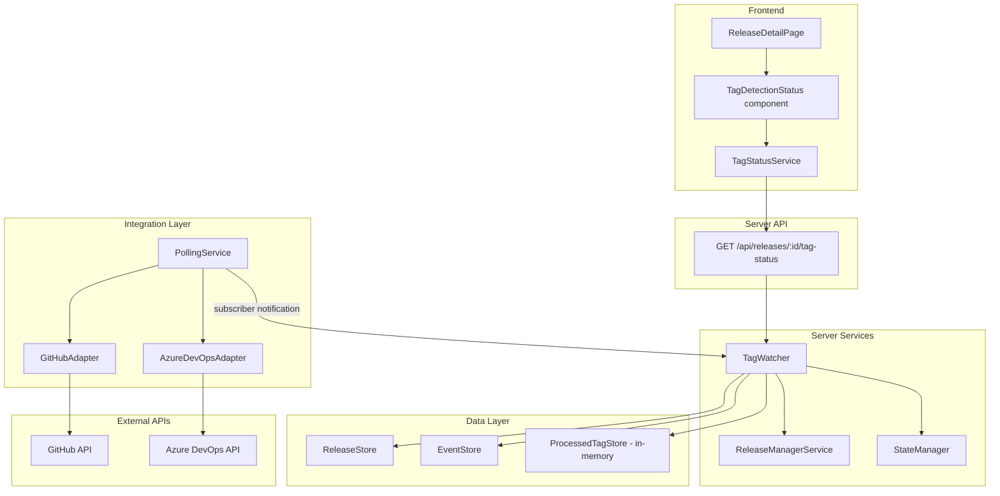

# Design Document: Release Version Tag Fetch

## Overview

This feature introduces a `TagWatcher` service that automatically detects new version tags in GitHub and Azure DevOps repositories, matches them to active releases by version string, and advances the matched release to its next pipeline stage. It integrates with the existing `PollingService` subscriber pattern to receive tag data on each polling cycle, uses the `StateManager` to validate transitions, and delegates stage updates to `ReleaseManagerService.updateReleaseStage`. A new REST endpoint and dashboard component expose tag detection status to release managers.

The design reuses the existing adapter methods (`GitHubAdapter.detectNewTags`, `AzureDevOpsAdapter.getTags`), the `Result<T, E>` error-handling pattern, and the `EventStore` for audit logging. Processed-tag state is persisted in-memory with a serializable structure so that duplicate transitions are avoided across polling cycles.

## Architecture



The architecture follows the existing layered pattern:

1. **Integration Layer**: The existing `PollingService` already fetches tags from GitHub (`pollGitHub` calls `getTags`) and can be extended for Azure. The `TagWatcher` subscribes to `PollingService` notifications to receive tag data without adding new polling loops.
2. **Service Layer**: `TagWatcher` is a new service that receives tag data from polling notifications, extracts version strings, matches them against active releases from `ReleaseStore`, validates transitions via `StateManager`, and applies them via `ReleaseManagerService.updateReleaseStage`. It maintains a `ProcessedTagStore` to track which tags have been handled.
3. **API Layer**: A new GET endpoint on the releases router returns tag detection status for a given release.
4. **Frontend**: A `TagDetectionStatus` component on the release detail page shows whether tag watching is active, the last detected tag, and the last check timestamp.

## Components and Interfaces

### Server-Side

#### TagWatcher (new service in `services/tag-watcher.ts`)

```typescript
export interface TagWatcherConfig {
  releaseStore: ReleaseStore;
  releaseManager: ReleaseManagerService;
  stateManager: StateManager;
  eventStore: EventStore;
  pollingService: PollingService;
  githubAdapter: GitHubAdapter;
  azureAdapter: AzureDevOpsAdapter;
  logger: Logger;
}

export interface TagMatchResult {
  releaseId: string;
  tagName: string;
  targetStage: ReleaseStage;
  repositoryUrl: string;
}

export interface TagDetectionInfo {
  active: boolean;
  lastDetectedTag: string | null;
  lastCheckAt: string | null; // ISO 8601
}

export class TagWatcher {
  constructor(config: TagWatcherConfig);

  /** Start listening to polling service notifications */
  start(): void;

  /** Stop listening */
  stop(): void;

  /** Get tag detection status for a release */
  getTagStatus(releaseId: string): TagDetectionInfo;

  /** Process tags from a polling notification (internal) */
  private handlePollingNotification(notification: DataChangeNotification): Promise<void>;

  /** Extract version string from a tag name */
  static extractVersion(tagName: string): string | null;

  /** Check if a tag name matches the version tag pattern */
  static isVersionTag(tagName: string): boolean;

  /** Match a version string against active releases for a given repository URL */
  private matchTagToRelease(version: string, repositoryUrl: string): Promise<TagMatchResult | null>;

  /** Determine the next stage for a release */
  private getNextStage(currentStage: ReleaseStage): ReleaseStage | null;
}
```

#### ProcessedTagStore (new in `services/processed-tag-store.ts`)

```typescript
export interface ProcessedTagRecord {
  tagName: string;
  repositoryUrl: string;
  processedAt: string; // ISO 8601
  releaseId: string;
  appliedStage: ReleaseStage;
}

export class ProcessedTagStore {
  /** Record a tag as processed */
  markProcessed(record: ProcessedTagRecord): void;

  /** Check if a tag has been processed for a repository */
  isProcessed(tagName: string, repositoryUrl: string): boolean;

  /** Get all processed tags for a repository */
  getProcessedTags(repositoryUrl: string): ProcessedTagRecord[];

  /** Get the latest processed timestamp for a repository */
  getLastProcessedTimestamp(repositoryUrl: string): Date | null;

  /** Export state for persistence */
  exportState(): ProcessedTagRecord[];

  /** Import state from persistence */
  importState(records: ProcessedTagRecord[]): void;
}
```

#### Version Tag Pattern Matching

The version extraction logic is a pure function suitable for property-based testing:

```typescript
// Regex: optional path prefix (e.g., "release/"), optional "v" prefix, then semver
const VERSION_TAG_PATTERN = /^(?:.*\/)?v?(\d+\.\d+\.\d+)$/;

function extractVersion(tagName: string): string | null {
  const match = tagName.match(VERSION_TAG_PATTERN);
  return match ? match[1] : null;
}

function isVersionTag(tagName: string): boolean {
  return VERSION_TAG_PATTERN.test(tagName);
}
```

#### Stage Progression Lookup

Uses the existing `StateManager.stageOrder` concept:

```typescript
const STAGE_ORDER: ReleaseStage[] = [
  ReleaseStage.ReleaseBranching,
  ReleaseStage.FinalReleaseCandidate,
  ReleaseStage.SubmitForAppStoreReview,
  ReleaseStage.RollOut1Percent,
  ReleaseStage.RollOut100Percent,
];

function getNextStage(current: ReleaseStage): ReleaseStage | null {
  const idx = STAGE_ORDER.indexOf(current);
  if (idx === -1 || idx === STAGE_ORDER.length - 1) return null;
  return STAGE_ORDER[idx + 1];
}
```

#### API Endpoint (added to `routes/releases.ts`)

```
GET /api/releases/:id/tag-status
```

Response (200):
```json
{
  "tagStatus": {
    "active": true,
    "lastDetectedTag": "v1.2.3",
    "lastCheckAt": "2025-01-15T10:30:00Z"
  }
}
```

Inactive (200 — no repository URL or source type):
```json
{
  "tagStatus": {
    "active": false,
    "lastDetectedTag": null,
    "lastCheckAt": null
  }
}
```

### Frontend

#### TagStatusService (new in `services/TagStatusService.ts`)

```typescript
export class TagStatusService {
  constructor(private apiClient: APIClient);

  async getTagStatus(releaseId: string): Promise<TagDetectionInfo>;
}
```

#### TagDetectionStatus component (new in `components/TagDetectionStatus.tsx`)

- Displays a status indicator showing whether tag watching is active
- Shows the last detected tag name and last check timestamp when active
- Shows "Watching for tags..." when active but no tags detected yet
- Not rendered when tag watching is inactive (no `repositoryUrl` or `sourceType`)
- Auto-refreshes via `useAutoRefresh` with 30-second interval (matching the release detail page refresh)

#### useTagStatus hook (new in `hooks/useTagStatus.ts`)

```typescript
export function useTagStatus(
  releaseId: string,
  service: TagStatusService,
  isActive: boolean
): {
  tagStatus: TagDetectionInfo | null;
  isLoading: boolean;
  error: Error | null;
  refresh: () => void;
}
```

### Azure DevOps Tag Change Detection

The existing `AzureDevOpsAdapter.getTags` returns all tags but has no `detectNewTags` equivalent like GitHub. The `TagWatcher` handles this by comparing the current tag list against the `ProcessedTagStore` to identify unprocessed tags. This avoids modifying the Azure adapter.

## Data Models

### TagMatchResult

| Field         | Type           | Description                                          |
|--------------|----------------|------------------------------------------------------|
| releaseId    | `string`       | ID of the matched active release                     |
| tagName      | `string`       | Full tag name as it appears in the repository         |
| targetStage  | `ReleaseStage` | The next stage the release should transition to       |
| repositoryUrl| `string`       | Repository URL to ensure tag-release repo match       |

### ProcessedTagRecord

| Field         | Type           | Description                                          |
|--------------|----------------|------------------------------------------------------|
| tagName      | `string`       | Full tag name                                        |
| repositoryUrl| `string`       | Repository URL the tag belongs to                    |
| processedAt  | `string`       | ISO 8601 timestamp of when the tag was processed     |
| releaseId    | `string`       | ID of the release the tag was matched to             |
| appliedStage | `ReleaseStage` | The stage that was applied as a result               |

### TagDetectionInfo

| Field           | Type              | Description                                      |
|----------------|-------------------|--------------------------------------------------|
| active         | `boolean`         | Whether tag watching is active for this release   |
| lastDetectedTag| `string \| null`  | Name of the last detected version tag             |
| lastCheckAt    | `string \| null`  | ISO 8601 timestamp of the last tag check          |

### Version Tag Pattern Examples

| Tag Name           | Extracted Version | Is Version Tag |
|-------------------|-------------------|----------------|
| `v1.2.3`          | `1.2.3`           | ✓              |
| `1.2.3`           | `1.2.3`           | ✓              |
| `release/1.2.3`   | `1.2.3`           | ✓              |
| `release/v1.2.3`  | `1.2.3`           | ✓              |
| `feature/abc`     | `null`            | ✗              |
| `v1.2`            | `null`            | ✗              |
| `latest`          | `null`            | ✗              |

### Polling Data Flow

The existing `PollingService.pollGitHub` already fetches tags. The `TagWatcher` subscribes to notifications and extracts the `data.tags` array from GitHub notifications. For Azure, the `TagWatcher` calls `AzureDevOpsAdapter.getTags` directly when it receives an Azure polling notification, since the current `pollAzure` method does not fetch tags.


## Correctness Properties

*A property is a characteristic or behavior that should hold true across all valid executions of a system — essentially, a formal statement about what the system should do. Properties serve as the bridge between human-readable specifications and machine-verifiable correctness guarantees.*

### Property 1: Version extraction round trip

*For any* string composed of an optional path prefix (containing `/`), an optional `v` character, and a valid semantic version `X.Y.Z` (where X, Y, Z are non-negative integers), `extractVersion` shall return the string `"X.Y.Z"`. Conversely, *for any* string that does not end with an optional `v` prefix followed by three dot-separated non-negative integers, `extractVersion` shall return `null`.

**Validates: Requirements 1.3, 2.3, 3.1**

### Property 2: Tag-to-release matching correctness

*For any* set of active releases and a version tag from a known repository URL, the matching function shall return a `TagMatchResult` if and only if exactly one active release has a `version` field equal to the extracted version string AND a `repositoryUrl` matching the tag's source repository. When zero or more than one releases match, the result shall be `null`.

**Validates: Requirements 3.2, 3.3, 3.4, 3.5, 3.6**

### Property 3: Next stage is always the immediate successor

*For any* `ReleaseStage` that is not `RollOut100Percent`, `getNextStage` shall return the stage immediately following it in the pipeline order (`ReleaseBranching → FinalReleaseCandidate → SubmitForAppStoreReview → RollOut1Percent → RollOut100Percent`). *For* `RollOut100Percent`, `getNextStage` shall return `null`.

**Validates: Requirements 4.1, 4.5**

### Property 4: Rejected transitions leave release unchanged

*For any* active release where the `StateManager` rejects the transition to the next stage, the release's `currentStage` shall remain unchanged after the `TagWatcher` processes a matching version tag.

**Validates: Requirements 4.4**

### Property 5: Processed tag idempotency

*For any* version tag that has been marked as processed in the `ProcessedTagStore`, processing the same tag again on a subsequent polling cycle shall result in no stage transition being applied — the operation is idempotent.

**Validates: Requirements 5.2**

### Property 6: Processed tag store export/import round trip

*For any* set of `ProcessedTagRecord` entries stored in the `ProcessedTagStore`, exporting the state and then importing it into a fresh store shall result in `isProcessed` returning `true` for every previously processed tag and `false` for any tag not in the exported set.

**Validates: Requirements 5.1, 5.3**

### Property 7: Tag status response reflects release configuration

*For any* release, the tag status endpoint shall return `active: true` if and only if the release has a non-empty `repositoryUrl` and a valid `sourceType`. When `active` is `false`, `lastDetectedTag` and `lastCheckAt` shall both be `null`.

**Validates: Requirements 6.1, 6.2**

### Property 8: Tag detection status rendering contains required fields

*For any* `TagDetectionInfo` where `active` is `true` and `lastDetectedTag` is non-null, the rendered `TagDetectionStatus` component shall contain the tag name string and a formatted timestamp string derived from `lastCheckAt`.

**Validates: Requirements 7.1**

## Error Handling

### Server-Side Errors

| Scenario                                      | Handling                                                                                          |
|----------------------------------------------|---------------------------------------------------------------------------------------------------|
| GitHub adapter returns error fetching tags    | `TagWatcher` logs error via `Logger.error`, skips this cycle, retries on next polling notification |
| Azure adapter returns error fetching tags     | `TagWatcher` logs error via `Logger.error`, skips this cycle, retries on next polling notification |
| Release not found during matching             | `TagWatcher` logs info, skips tag (release may have been deleted)                                 |
| Version tag matches zero releases             | `TagWatcher` logs info message, takes no action                                                   |
| Version tag matches multiple releases         | `TagWatcher` logs warning with release IDs, takes no action                                       |
| StateManager rejects transition               | `TagWatcher` logs warning with validation errors, skips transition, marks tag as processed         |
| ReleaseManagerService.updateReleaseStage fails| `TagWatcher` logs error, does NOT mark tag as processed (will retry next cycle)                    |
| ProcessedTagStore state corrupted             | `TagWatcher` re-evaluates all tags; StateManager prevents duplicate transitions                   |
| Release already at final stage                | `getNextStage` returns `null`, `TagWatcher` skips transition silently                             |

### Frontend Errors

| Scenario                    | Handling                                                              |
|----------------------------|-----------------------------------------------------------------------|
| Tag status API returns error| `useTagStatus` sets error state, component shows fallback message     |
| Network failure             | Retry on next auto-refresh cycle (30 seconds)                         |
| Release has no tag watching | Component is not rendered (conditional rendering)                     |

## Testing Strategy

### Property-Based Testing

The project uses **fast-check** (already a dependency) with **Jest** as the test runner. `fast-check` should be added as a dev dependency in `packages/server` if not already present.

Each property test must:
- Run a minimum of **100 iterations**
- Reference its design property with a tag comment: `// Feature: release-version-tag-fetch, Property {N}: {title}`
- Use `fc.assert(fc.property(...))` pattern

Property tests to implement:

1. **Property 1 — Version extraction round trip**: Generate random strings with optional path prefixes, optional `v`, and three dot-separated non-negative integers. Assert `extractVersion` returns the bare semver. Also generate random non-matching strings and assert `extractVersion` returns `null`.
2. **Property 2 — Tag-to-release matching**: Generate random sets of active releases (varying versions, repository URLs, statuses) and random version tags. Assert the matching function returns a `TagMatchResult` only when exactly one release matches by version AND repository URL.
3. **Property 3 — Next stage successor**: For each `ReleaseStage` value, assert `getNextStage` returns the correct successor or `null` for the final stage. Since the enum is finite, this can also be exhaustively tested, but the property formulation ensures correctness if stages are ever added.
4. **Property 4 — Rejected transitions**: Generate random releases with states where transitions would be invalid (e.g., missing prerequisites). Mock `StateManager` to reject. Assert the release stage is unchanged after `TagWatcher` processing.
5. **Property 5 — Processed tag idempotency**: Generate random tag names and repository URLs. Mark them as processed. Process them again. Assert no stage transition calls are made on the second processing.
6. **Property 6 — Store export/import round trip**: Generate random sets of `ProcessedTagRecord` entries. Export from one store, import into a fresh store. Assert `isProcessed` returns the same results for all tags.
7. **Property 7 — Tag status response**: Generate random releases with varying `repositoryUrl` and `sourceType` values (including empty/null). Assert the endpoint returns `active: true` iff both fields are present, and `null` fields when inactive.
8. **Property 8 — Tag detection status rendering**: Generate random `TagDetectionInfo` objects with `active: true` and non-null `lastDetectedTag`. Render the component. Assert the DOM contains the tag name and a timestamp.

### Unit Tests

Unit tests complement property tests for specific examples and edge cases:

- **Version extraction specific cases**: `v1.2.3` → `1.2.3`, `release/v1.2.3` → `1.2.3`, `1.2.3` → `1.2.3`, `feature/abc` → `null`, `v1.2` → `null`
- **Azure new tag detection**: Verify that tags already in `ProcessedTagStore` are filtered out when comparing against `getTags` results
- **Polling subscriber wiring**: Verify `TagWatcher.start()` subscribes to `PollingService` and `stop()` unsubscribes
- **Event recording**: Verify a `stage_change` event is recorded in `EventStore` after a successful transition (already handled by `ReleaseManagerService`)
- **Error logging**: Verify adapter errors are logged with appropriate level and context
- **State recovery**: Verify that after `ProcessedTagStore` state is cleared, re-processing tags does not create duplicate transitions because `StateManager` rejects same-stage transitions
- **Tag status endpoint**: Verify 200 response shape for active and inactive releases
- **Component conditional rendering**: Verify `TagDetectionStatus` is not rendered when `active` is `false`
- **Watching state display**: Verify "Watching for tags..." message when `active` is `true` but `lastDetectedTag` is `null`
