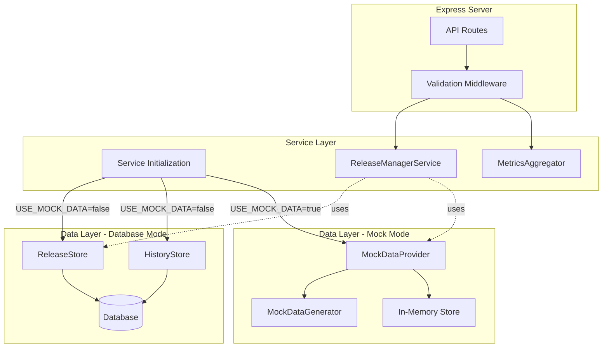

# Design Document: Server Mock Data

## Overview

The server-mock-data feature adds a mock data mode to the Release Manager Tool server, enabling developers to run and demo the web application without requiring database setup. This design introduces a MockDataProvider that generates realistic release management data and integrates seamlessly with the existing Express.js API endpoints.

The solution follows a strategy pattern where the server can operate in two modes:
- **Database Mode**: Uses ReleaseStore and HistoryStore backed by a database connection
- **Mock Mode**: Uses MockDataProvider backed by in-memory data structures

The mode is controlled via the USE_MOCK_DATA environment variable, allowing developers to switch between modes without code changes. Mock mode maintains full API compatibility with database mode, ensuring the web application works identically in both configurations.

Key design goals:
- Zero code changes required in the web application
- Full API compatibility between mock and database modes
- Realistic mock data that demonstrates all features
- In-memory persistence of changes during server session
- Clean separation between mock and database implementations

## Architecture

### High-Level Architecture



### Component Responsibilities

**MockDataProvider**
- Implements the same interface as ReleaseStore and HistoryStore
- Delegates to MockDataGenerator for initial data creation
- Maintains in-memory state for data mutations
- Handles filtering and querying operations
- Validates mutations using the same rules as database mode

**MockDataGenerator**
- Generates realistic mock releases across all platforms
- Creates associated data (blockers, sign-offs, distributions, metrics)
- Ensures data consistency and referential integrity
- Produces deterministic but varied data sets

**Service Initialization**
- Reads USE_MOCK_DATA environment variable
- Instantiates either database stores or MockDataProvider
- Injects appropriate dependencies into services
- Logs the active mode at startup

### Integration Points

The MockDataProvider integrates at the data layer, replacing ReleaseStore and HistoryStore when mock mode is enabled. This ensures:
- No changes required in ReleaseManagerService or MetricsAggregator
- No changes required in API routes or middleware
- Identical validation and error handling
- Consistent response formats

## Components and Interfaces

### MockDataProvider

```typescript
interface DataProvider {
  // Release operations
  create(release: Release): Promise<Result<Release, ApplicationError>>;
  findById(id: string): Promise<Result<Release | null, ApplicationError>>;
  findAll(filters?: ReleaseFilters): Promise<Result<Release[], ApplicationError>>;
  update(id: string, updates: Partial<Release>): Promise<Result<Release, ApplicationError>>;
  delete(id: string): Promise<Result<void, ApplicationError>>;
  
  // Blocker operations
  addBlocker(releaseId: string, blocker: Blocker): Promise<Result<Blocker, ApplicationError>>;
  resolveBlocker(releaseId: string, blockerId: string): Promise<Result<Blocker, ApplicationError>>;
  
  // Sign-off operations
  updateSignOff(releaseId: string, signOff: SignOff): Promise<Result<SignOff, ApplicationError>>;
  
  // Distribution operations
  addDistribution(releaseId: string, distribution: Distribution): Promise<Result<Distribution, ApplicationError>>;
  updateDistribution(releaseId: string, channel: string, status: DistributionStatus): Promise<Result<Distribution, ApplicationError>>;
  
  // Stage and status operations
  updateStage(releaseId: string, stage: ReleaseStage): Promise<Result<Release, ApplicationError>>;
  updateStatus(releaseId: string, status: ReleaseStatus): Promise<Result<Release, ApplicationError>>;
  updateRollout(releaseId: string, percentage: number): Promise<Result<Release, ApplicationError>>;
  
  // ITGC operations
  updateITGC(releaseId: string, itgcStatus: ITGCStatus): Promise<Result<Release, ApplicationError>>;
  
  // History operations
  getHistory(filters?: HistoryFilters): Promise<Result<Release[], ApplicationError>>;
  createSnapshot(release: Release): Promise<Result<void, ApplicationError>>;
}

class MockDataProvider implements DataProvider {
  private releases: Map<string, Release>;
  private history: Release[];
  private generator: MockDataGenerator;
  
  constructor() {
    this.releases = new Map();
    this.history = [];
    this.generator = new MockDataGenerator();
    this.initializeData();
  }
  
  private initializeData(): void {
    const mockReleases = this.generator.generateReleases();
    mockReleases.forEach(release => {
      this.releases.set(release.id, release);
      this.history.push({ ...release });
    });
  }
  
  // Implementation of all DataProvider methods
  // Each method validates inputs, performs operations on in-memory data,
  // and returns Results with proper error handling
}
```

### MockDataGenerator

```typescript
interface MockDataConfig {
  releaseCount: number;
  minBlockersPerRelease: number;
  signOffSquads: string[];
  platforms: Platform[];
}

class MockDataGenerator {
  private config: MockDataConfig;
  
  constructor(config?: Partial<MockDataConfig>) {
    this.config = {
      releaseCount: 10,
      minBlockersPerRelease: 2,
      signOffSquads: ['Backend', 'Frontend', 'Mobile', 'QA', 'Security'],
      platforms: [Platform.iOS, Platform.Android, Platform.Desktop],
      ...config
    };
  }
  
  generateReleases(): Release[] {
    const releases: Release[] = [];
    
    // Generate releases for each platform
    for (const platform of this.config.platforms) {
      releases.push(...this.generatePlatformReleases(platform));
    }
    
    return releases;
  }
  
  private generatePlatformReleases(platform: Platform): Release[] {
    // Generate 3-4 releases per platform with varied stages and statuses
  }
  
  private generateBlockers(stage: ReleaseStage): Blocker[] {
    // Generate blockers for early-stage releases
  }
  
  private generateSignOffs(): SignOff[] {
    // Generate sign-offs with mixed approval states
  }
  
  private generateDistributions(platform: Platform, status: ReleaseStatus): Distribution[] {
    // Generate platform-appropriate distribution channels
  }
  
  private generateQualityMetrics(stage: ReleaseStage): QualityMetrics | undefined {
    // Generate metrics for rollout stages
  }
  
  private generateDAUStats(stage: ReleaseStage): DAUStats | undefined {
    // Generate DAU statistics for rollout stages
  }
  
  private generateITGCStatus(stage: ReleaseStage): ITGCStatus {
    // Generate ITGC compliance status
  }
}
```

### Service Initialization Updates

```typescript
export function initializeServices(): Services {
  const useMockData = process.env.USE_MOCK_DATA === 'true';
  
  console.log(`[Server] Starting in ${useMockData ? 'MOCK' : 'DATABASE'} mode`);
  
  let dataProvider: DataProvider;
  
  if (useMockData) {
    dataProvider = new MockDataProvider();
  } else {
    const dbConfig = getDefaultConfig();
    const dbConnection = createConnection(dbConfig);
    dataProvider = new ReleaseStore({ connection: dbConnection });
    // Note: HistoryStore functionality is integrated into DataProvider interface
  }
  
  // Initialize application layer with dataProvider
  const stateManager = new StateManager();
  const configParser = new JSONConfigParser();
  const cache = new Cache();
  
  const releaseManager = new ReleaseManagerService({
    dataProvider,
    stateManager,
    configParser
  });
  
  // ... rest of service initialization
}
```

## Data Models

The mock data generator produces data conforming to existing domain types:

### Release Structure
```typescript
{
  id: string;              // UUID format
  platform: Platform;      // iOS, Android, or Desktop
  status: ReleaseStatus;   // Upcoming, Current, or Production
  currentStage: ReleaseStage;
  version: string;         // Semantic version (e.g., "2.5.0")
  branchName: string;      // e.g., "release/2.5.0"
  sourceType: SourceType;  // github or azure
  repositoryUrl: string;
  latestBuild: string;
  latestPassingBuild: string;
  latestAppStoreBuild: string;
  blockers: Blocker[];
  signOffs: SignOff[];
  rolloutPercentage: number;
  qualityMetrics?: QualityMetrics;
  dauStats?: DAUStats;
  itgcStatus: ITGCStatus;
  distributions: Distribution[];
  createdAt: Date;
  updatedAt: Date;
  lastSyncedAt: Date;
}
```

### Mock Data Characteristics

**Platform Distribution**
- At least 3 iOS releases
- At least 3 Android releases  
- At least 3 Desktop releases
- Total of 10+ releases

**Status Distribution**
- Mix of Upcoming, Current, and Production statuses
- Production releases have higher rollout percentages

**Stage Distribution**
- Release Branching (early stage)
- Final Release Candidate
- Submit For App Store Review
- Roll Out 1%
- Roll Out 100%

**Blockers**
- 2+ blockers for releases in early stages
- Severity levels: critical, high, medium
- Some resolved (with resolvedAt timestamp), some open
- Realistic titles, descriptions, assignees, issue URLs

**Sign-Offs**
- 3+ squads per release: Backend, Frontend, Mobile, QA, Security
- Mixed approval states (some approved, some pending)
- Approved sign-offs include approvedBy, approvedAt, comments

**Distributions**
- 2+ channels per release
- Platform-specific channels:
  - iOS: App Store, TestFlight
  - Android: Google Play, Internal Testing
  - Desktop: Microsoft Store, Direct Download
- Status progression: pending → submitted → approved → live
- Production releases have at least one live distribution

**Quality Metrics** (for rollout stages)
- crashRate: 0.0 - 5.0%
- cpuExceptionRate: 0.0 - 3.0%
- Thresholds: crashRate 2.0%, cpuException 1.5%
- Some releases exceed thresholds, some don't

**DAU Statistics** (for rollout stages)
- dailyActiveUsers: 10,000 - 1,000,000
- trend: 7+ data points showing daily progression
- Both increasing and decreasing trends

**ITGC Status**
- compliant: mixed true/false
- rolloutComplete: true only for Roll Out 100% stage
- details: descriptive text about compliance
- lastCheckedAt: recent timestamp


## Correctness Properties

A property is a characteristic or behavior that should hold true across all valid executions of a system—essentially, a formal statement about what the system should do. Properties serve as the bridge between human-readable specifications and machine-verifiable correctness guarantees.

### Property 1: Semantic Version Format

For all generated releases, the version string must match the semantic versioning pattern MAJOR.MINOR.PATCH (e.g., "2.5.0").

**Validates: Requirements 2.5**

### Property 2: Rollout Percentage Range

For all generated releases, the rolloutPercentage must be between 0 and 100 (inclusive).

**Validates: Requirements 2.7**

### Property 3: Unique Blocker IDs

For all generated blockers across all releases, no two blockers shall have the same ID.

**Validates: Requirements 3.6**

### Property 4: Sign-Off Data Consistency

For all sign-offs, if approved is true, then approvedBy, approvedAt, and comments must be present; if approved is false, then approvedBy and approvedAt must be absent.

**Validates: Requirements 4.4, 4.5**

### Property 5: Platform-Appropriate Distribution Channels

For all distributions, the channel name must be appropriate for the release's platform (e.g., "App Store" or "TestFlight" for iOS, "Google Play" for Android, "Microsoft Store" for Desktop).

**Validates: Requirements 5.2**

### Property 6: Production Releases Have Live Distributions

For all releases with status Production, there must be at least one distribution with status "live".

**Validates: Requirements 5.5**

### Property 7: Rollout Stages Have Quality Metrics

For all releases with currentStage containing "Roll Out", the qualityMetrics field must be present and non-null.

**Validates: Requirements 6.1**

### Property 8: Quality Metrics Within Valid Ranges

For all quality metrics, crashRate must be between 0.0 and 5.0, and cpuExceptionRate must be between 0.0 and 3.0.

**Validates: Requirements 6.2, 6.3**

### Property 9: Rollout Stages Have DAU Statistics

For all releases with currentStage containing "Roll Out", the dauStats field must be present and non-null.

**Validates: Requirements 7.1**

### Property 10: DAU Count Range

For all DAU statistics, dailyActiveUsers must be between 10,000 and 1,000,000 (inclusive).

**Validates: Requirements 7.2**

### Property 11: DAU Trend Length

For all DAU statistics, the trend array must contain at least 7 data points.

**Validates: Requirements 7.3**

### Property 12: All Releases Have ITGC Status

For all generated releases, the itgcStatus field must be present and non-null.

**Validates: Requirements 8.1**

### Property 13: Rollout Complete Correctness

For all releases, rolloutComplete must be true if and only if currentStage is "Roll Out 100%".

**Validates: Requirements 8.3, 8.4**

### Property 14: Platform Filtering

For any platform value, when GET /api/releases is called with platform query parameter in Mock_Mode, all returned releases must have that platform.

**Validates: Requirements 10.1**

### Property 15: Status Filtering

For any status value, when GET /api/releases/history is called with status query parameter in Mock_Mode, all returned releases must have that status.

**Validates: Requirements 10.2**

### Property 16: Date Range Filtering

For any startDate and endDate values, when GET /api/releases/history is called with these parameters in Mock_Mode, all returned releases must have createdAt within that date range.

**Validates: Requirements 10.3**

### Property 17: Release Creation Persistence

For any valid release data, when POST /api/releases is called in Mock_Mode, the created release must be retrievable via GET /api/releases/:id with the same data.

**Validates: Requirements 11.1**

### Property 18: Blocker Addition Persistence

For any valid blocker data and existing release, when POST /api/releases/:id/blockers is called in Mock_Mode, the blocker must appear in the release's blockers array on subsequent GET requests.

**Validates: Requirements 11.2**

### Property 19: Blocker Resolution

For any existing blocker, when PATCH /api/releases/:id/blockers/:blockerId/resolve is called in Mock_Mode, the blocker's resolvedAt field must be set to a timestamp.

**Validates: Requirements 11.3**

### Property 20: Sign-Off Update Persistence

For any sign-off data and existing release, when POST /api/releases/:id/signoffs is called in Mock_Mode, the sign-off must be updated in the release's signOffs array on subsequent GET requests.

**Validates: Requirements 11.4**

### Property 21: Stage Update Persistence

For any valid stage value and existing release, when PATCH /api/releases/:id/stage is called in Mock_Mode, the release's currentStage must reflect the new value on subsequent GET requests.

**Validates: Requirements 11.5**

### Property 22: Status Update Persistence

For any valid status value and existing release, when PATCH /api/releases/:id/status is called in Mock_Mode, the release's status must reflect the new value on subsequent GET requests.

**Validates: Requirements 11.6**

### Property 23: Rollout Update Persistence

For any valid percentage value (0-100) and existing release, when PATCH /api/releases/:id/rollout is called in Mock_Mode, the release's rolloutPercentage must reflect the new value on subsequent GET requests.

**Validates: Requirements 11.7**

### Property 24: Distribution Addition Persistence

For any valid distribution data and existing release, when POST /api/releases/:id/distributions is called in Mock_Mode, the distribution must appear in the release's distributions array on subsequent GET requests.

**Validates: Requirements 11.8**

### Property 25: Distribution Status Update Persistence

For any valid status value and existing distribution, when PATCH /api/releases/:id/distributions/:channel is called in Mock_Mode, the distribution's status must reflect the new value on subsequent GET requests.

**Validates: Requirements 11.9**

### Property 26: ITGC Update Persistence

For any valid ITGC status data and existing release, when PATCH /api/releases/:id/itgc is called in Mock_Mode, the release's itgcStatus must reflect the new values on subsequent GET requests.

**Validates: Requirements 11.10**

### Property 27: In-Memory Mutation Persistence

For any modification made through API endpoints in Mock_Mode, subsequent GET requests within the same server session must return the modified data.

**Validates: Requirements 12.1, 12.2**

### Property 28: Referential Integrity

For all releases, all referenced entities (blockers, sign-offs, distributions) must be correctly associated with their parent release and accessible through the release's data structure.

**Validates: Requirements 12.4**

### Property 29: Invalid Data Validation

For any invalid release or update data, when POST or PATCH requests are made in Mock_Mode, the server must return a 400 status code with validation error messages.

**Validates: Requirements 13.1, 13.2**

### Property 30: Non-Existent Resource Errors

For any non-existent release ID or blocker ID, when requests reference these IDs in Mock_Mode, the server must return a 404 status code.

**Validates: Requirements 13.3, 13.4**

### Property 31: Validation Consistency Across Modes

For any invalid input data, the validation errors returned in Mock_Mode must match the validation errors returned in Database_Mode.

**Validates: Requirements 13.5**

## Error Handling

### Error Categories

**Configuration Errors**
- Missing or invalid USE_MOCK_DATA environment variable: Log warning and default to database mode
- Service initialization failures: Log error with stack trace and exit with non-zero code

**Validation Errors (400)**
- Invalid release data (missing required fields, invalid enum values)
- Invalid version format (not semantic versioning)
- Invalid rollout percentage (outside 0-100 range)
- Invalid date formats
- Invalid platform, status, or stage values
- Return structured error response: `{ error: string, details: string[] }`

**Not Found Errors (404)**
- Non-existent release ID
- Non-existent blocker ID
- Non-existent distribution channel
- Return structured error response: `{ error: string, resourceId: string }`

**Internal Errors (500)**
- Unexpected exceptions during data generation
- Memory allocation failures
- Unhandled edge cases
- Log full error details and return generic error message to client

### Error Response Format

All errors follow a consistent JSON structure:

```typescript
interface ErrorResponse {
  error: string;           // Human-readable error message
  code: string;            // Machine-readable error code
  details?: string[];      // Additional validation details
  resourceId?: string;     // ID of missing resource (for 404s)
  timestamp: string;       // ISO 8601 timestamp
}
```

### Error Handling Strategy

**Fail Fast**: Configuration errors during startup should prevent server from starting
**Graceful Degradation**: Runtime errors should not crash the server
**Consistent Behavior**: Mock mode and database mode should return identical error responses for the same invalid inputs
**Detailed Logging**: All errors should be logged with context (request ID, user action, timestamp)
**Client-Friendly Messages**: Error responses should be actionable and not expose internal implementation details

## Testing Strategy

### Dual Testing Approach

This feature requires both unit tests and property-based tests to ensure comprehensive coverage:

**Unit Tests** focus on:
- Specific examples of mock data generation (e.g., "generates at least 10 releases")
- Edge cases (e.g., empty query parameters, server restart behavior)
- Integration points (e.g., service initialization with different env var values)
- Specific API endpoint responses in mock mode
- Error conditions with specific invalid inputs

**Property-Based Tests** focus on:
- Universal properties that hold for all generated data (e.g., "all versions are semantic")
- Filtering behavior across all possible filter values
- Mutation persistence across all update operations
- Validation consistency across all invalid inputs
- Data integrity constraints across all releases

Together, unit tests catch concrete bugs in specific scenarios, while property tests verify general correctness across the entire input space.

### Property-Based Testing Configuration

**Library**: Use `fast-check` for TypeScript property-based testing

**Configuration**:
- Minimum 100 iterations per property test (to ensure statistical coverage)
- Seed-based reproducibility for failed tests
- Shrinking enabled to find minimal failing cases

**Test Tagging**: Each property test must include a comment referencing the design property:

```typescript
// Feature: server-mock-data, Property 1: Semantic Version Format
it('all generated releases have semantic version format', () => {
  fc.assert(
    fc.property(fc.constant(mockDataProvider.generateReleases()), (releases) => {
      return releases.every(r => /^\d+\.\d+\.\d+$/.test(r.version));
    }),
    { numRuns: 100 }
  );
});
```

### Test Organization

```
packages/server/src/
  data/
    mock-data-provider.ts
    mock-data-provider.test.ts        # Unit tests
    mock-data-provider.property.test.ts  # Property tests
    mock-data-generator.ts
    mock-data-generator.test.ts       # Unit tests
    mock-data-generator.property.test.ts # Property tests
  routes/
    releases.test.ts                  # Add mock mode tests
    metrics.test.ts                   # Add mock mode tests
    health.test.ts                    # Add mock mode tests
  integration/
    mock-mode.integration.test.ts     # End-to-end tests
```

### Unit Test Coverage

**Mock Data Generation**:
- Verify minimum counts (10 releases, 3 per platform, 2 blockers, etc.)
- Verify all enum values are represented (statuses, stages, severities)
- Verify specific threshold values (crash rate 2.0, CPU exception 1.5)
- Verify both states exist (approved/not approved, compliant/not compliant)

**Service Initialization**:
- USE_MOCK_DATA="true" initializes MockDataProvider
- USE_MOCK_DATA="false" initializes database stores
- USE_MOCK_DATA unset defaults to database mode
- Startup logs indicate correct mode

**API Endpoints**:
- Each endpoint returns mock data in mock mode
- Health check includes mode information
- No database connection attempted in mock mode

**Error Handling**:
- Invalid data returns 400 with validation messages
- Non-existent IDs return 404
- Same validation in both modes

### Property Test Coverage

**Data Generation Properties**:
- All versions match semantic versioning pattern (Property 1)
- All rollout percentages in 0-100 range (Property 2)
- All blocker IDs are unique (Property 3)
- Sign-off data consistency (Property 4)
- Platform-appropriate channels (Property 5)
- Production releases have live distributions (Property 6)
- Rollout stages have metrics and DAU stats (Properties 7, 9)
- Metrics within valid ranges (Property 8)
- DAU counts and trends meet requirements (Properties 10, 11)
- All releases have ITGC status (Property 12)
- Rollout complete correctness (Property 13)

**Filtering Properties**:
- Platform filtering returns only matching platforms (Property 14)
- Status filtering returns only matching statuses (Property 15)
- Date range filtering returns only releases in range (Property 16)

**Mutation Properties**:
- All create/update operations persist correctly (Properties 17-26)
- In-memory persistence within session (Property 27)
- Referential integrity maintained (Property 28)

**Validation Properties**:
- Invalid data returns 400 (Property 29)
- Non-existent resources return 404 (Property 30)
- Validation consistent across modes (Property 31)

### Integration Testing

**End-to-End Scenarios**:
1. Start server in mock mode → verify all endpoints work → create release → verify persistence → restart server → verify fresh data
2. Start server in database mode → verify database connection → switch to mock mode → verify no database connection
3. Filter releases by platform → update release → verify filtered results reflect update
4. Create release with blockers → resolve blocker → verify blocker marked resolved
5. Update release stage to rollout → verify quality metrics and DAU stats present

### Test Data Generators

For property-based tests, create generators for:
- Valid release data (all required fields, valid enum values)
- Invalid release data (missing fields, invalid values)
- Valid filter parameters (platforms, statuses, date ranges)
- Valid update payloads (stage changes, status changes, rollout percentages)
- Invalid update payloads (out-of-range values, invalid types)

### Continuous Integration

- Run all tests on every commit
- Fail build if any property test fails
- Track test execution time (property tests may be slower)
- Generate coverage reports (aim for >90% coverage on mock data code)
- Run integration tests in both mock and database modes

