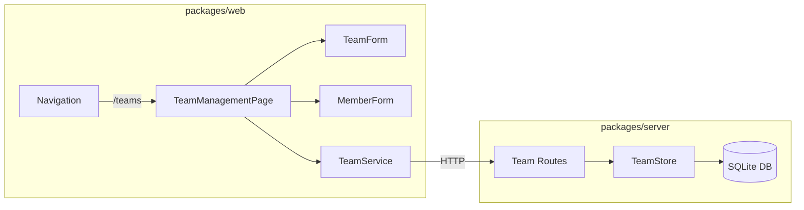
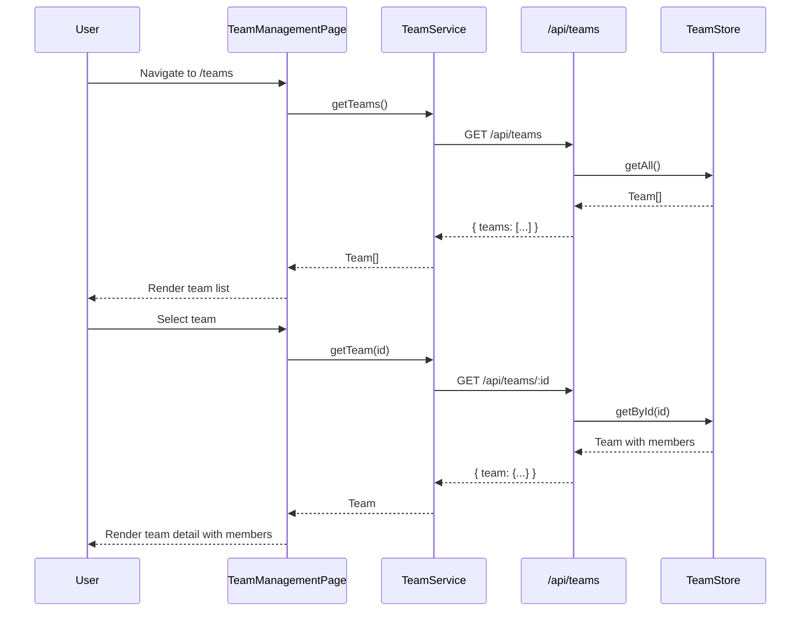

# Design Document: Team Management

## Overview

This design adds team management to the Release Manager application. The feature introduces a new domain entity (Team with Members), a data store, REST API routes, and a React page with forms for CRUD operations.

The implementation follows existing codebase patterns:
- Server: `TeamStore` (modeled after `ConfigStore`), `createTeamRoutes` (modeled after `createConfigRoutes`), new domain types
- Web: `TeamManagementPage` with inline team detail view, `TeamService` for API calls, navigation integration via `NavLink`

Teams are stored in SQLite via `better-sqlite3` (consistent with the project's database approach). Each team has a unique name constraint. Members belong to exactly one team and are cascade-deleted when the team is removed.

## Architecture

### System Architecture



### Data Flow



### Page Layout

The `TeamManagementPage` uses a two-panel layout:
- Left panel: team list with create form
- Right panel: selected team detail with member list and add member form

On narrow screens, the panels stack vertically.

## Components and Interfaces

### Server Components

#### 1. TeamStore

**File:** `packages/server/src/data/team-store.ts`

Follows the `ConfigStore` pattern — an in-memory `Map`-based store with `Result` return types.

```typescript
interface TeamRow {
  id: string;
  name: string;
  createdAt: string;   // ISO 8601
  updatedAt: string;   // ISO 8601
}

interface MemberRow {
  id: string;
  teamId: string;
  name: string;
  email?: string;
  createdAt: string;   // ISO 8601
}

class TeamStore {
  getAll(): Promise<Result<TeamSummary[], ApplicationError>>;
  getById(id: string): Promise<Result<TeamDetail, ApplicationError>>;
  create(name: string): Promise<Result<TeamDetail, ApplicationError>>;
  delete(id: string): Promise<Result<void, ApplicationError>>;
  addMember(teamId: string, name: string, email?: string): Promise<Result<Member, ApplicationError>>;
  removeMember(teamId: string, memberId: string): Promise<Result<void, ApplicationError>>;
}
```

- `getAll` returns `TeamSummary[]` (id, name, memberCount) for the list view.
- `getById` returns `TeamDetail` (id, name, members[], createdAt, updatedAt) for the detail view.
- `create` enforces unique team name via a linear scan of existing names, returns `ConflictError` on duplicate.
- `delete` removes the team and all its members.
- `addMember` returns `NotFoundError` if team doesn't exist.
- `removeMember` returns `NotFoundError` if team or member doesn't exist.

#### 2. Team Routes

**File:** `packages/server/src/routes/teams.ts`

```typescript
function createTeamRoutes(teamStore: TeamStore): Router;
```

| Method | Path | Handler | Success | Error |
|--------|------|---------|---------|-------|
| GET | `/` | List all teams | 200 `{ teams: TeamSummary[] }` | 500 |
| POST | `/` | Create team | 201 `{ team: TeamDetail }` | 400 (empty name), 409 (duplicate) |
| GET | `/:id` | Get team detail | 200 `{ team: TeamDetail }` | 404 |
| DELETE | `/:id` | Delete team | 204 | 404 |
| POST | `/:id/members` | Add member | 201 `{ member: Member }` | 400 (empty name), 404 (team) |
| DELETE | `/:id/members/:memberId` | Remove member | 204 | 404 |

Validation is done inline in the route handlers (checking for empty/whitespace-only names). Errors are thrown and caught by the global `errorHandler` middleware.

### Web Components

#### 3. TeamService

**File:** `packages/web/src/services/TeamService.ts`

```typescript
class TeamService {
  constructor(private client: APIClient);
  getTeams(): Promise<TeamSummary[]>;
  getTeam(id: string): Promise<TeamDetail>;
  createTeam(name: string): Promise<TeamDetail>;
  deleteTeam(id: string): Promise<void>;
  addMember(teamId: string, name: string, email?: string): Promise<Member>;
  removeMember(teamId: string, memberId: string): Promise<void>;
}
```

Registered in `ServicesContext` alongside existing services.

#### 4. TeamManagementPage

**File:** `packages/web/src/pages/TeamManagementPage.tsx` + `.module.css`

State management:
- `teams: TeamSummary[]` — loaded on mount
- `selectedTeamId: string | null` — which team is selected
- `selectedTeam: TeamDetail | null` — loaded when a team is selected
- `isLoading: boolean` — loading state for team list
- `error: string | null` — error message

The page fetches the team list on mount. Selecting a team fetches its detail. Create/delete/add-member/remove-member operations optimistically update local state and call the API.

#### 5. TeamForm

**File:** `packages/web/src/components/TeamForm.tsx` + `.module.css`

```typescript
interface TeamFormProps {
  onSubmit: (name: string) => Promise<void>;
}
```

A controlled input + submit button. Validates that the name is non-empty before calling `onSubmit`. Displays inline validation errors and API errors (e.g., duplicate name from 409 response).

#### 6. MemberForm

**File:** `packages/web/src/components/MemberForm.tsx` + `.module.css`

```typescript
interface MemberFormProps {
  onSubmit: (name: string, email?: string) => Promise<void>;
}
```

A controlled input for name (required) and email (optional) + submit button. Validates that name is non-empty.

#### 7. Navigation Update

**File:** `packages/web/src/components/Navigation.tsx`

Add a `NavLink` to `/teams` with label "Teams", following the existing pattern. `NavLink`'s `isActive` prop handles the active state styling automatically.

#### 8. App Router Update

**File:** `packages/web/src/App.tsx`

Add a lazy-loaded route for `/teams` pointing to `TeamManagementPage`, wrapped in `ProtectedRoute` and `Layout`, matching the existing route pattern.

## Data Models

### New Domain Types

**File:** `packages/server/src/domain/types.ts` (appended)

```typescript
/** Summary of a team for list views */
interface TeamSummary {
  id: string;
  name: string;
  memberCount: number;
}

/** Full team detail including members */
interface TeamDetail {
  id: string;
  name: string;
  members: Member[];
  createdAt: string;
  updatedAt: string;
}

/** A member of a team */
interface Member {
  id: string;
  name: string;
  email?: string;
  createdAt: string;
}
```

### Frontend Types

**File:** `packages/web/src/types/team.ts`

Mirrors the server types: `TeamSummary`, `TeamDetail`, `Member`. These are plain interfaces used by `TeamService` and the page component.

### Database Schema Addition

**File:** `packages/server/src/data/migrations/002_teams_schema.ts`

```sql
CREATE TABLE IF NOT EXISTS teams (
  id TEXT PRIMARY KEY,
  name TEXT NOT NULL UNIQUE,
  created_at TEXT NOT NULL,
  updated_at TEXT NOT NULL
);

CREATE TABLE IF NOT EXISTS team_members (
  id TEXT PRIMARY KEY,
  team_id TEXT NOT NULL,
  name TEXT NOT NULL,
  email TEXT,
  created_at TEXT NOT NULL,
  FOREIGN KEY (team_id) REFERENCES teams(id) ON DELETE CASCADE
);
```

The `UNIQUE` constraint on `teams.name` enforces uniqueness at the database level (Requirement 7.3). `ON DELETE CASCADE` on `team_members.team_id` ensures members are removed when a team is deleted (Requirement 6.3).


## Correctness Properties

*A property is a characteristic or behavior that should hold true across all valid executions of a system — essentially, a formal statement about what the system should do. Properties serve as the bridge between human-readable specifications and machine-verifiable correctness guarantees.*

### Property 1: Team list displays all teams with name and member count

*For any* array of `TeamSummary` objects, rendering the team list should produce output containing every team's name and its member count.

**Validates: Requirements 1.1, 1.3**

### Property 2: Whitespace-only names are rejected by forms

*For any* string composed entirely of whitespace characters (including empty string), submitting it as a team name or member name should be rejected, and the form should display a validation error.

**Validates: Requirements 2.2, 4.2**

### Property 3: Creating a team returns a valid object with unique ID and timestamps

*For any* valid (non-empty, non-whitespace) team name, calling POST `/api/teams` should return a team object where the `id` is a non-empty string, `name` matches the input, and `createdAt`/`updatedAt` are valid ISO 8601 timestamps.

**Validates: Requirements 2.4**

### Property 4: Duplicate team name returns 409 Conflict

*For any* valid team name, creating a team with that name and then creating another team with the same name should result in a 409 Conflict response on the second attempt. The first team should remain unchanged.

**Validates: Requirements 2.5, 7.3**

### Property 5: Team detail includes all members

*For any* team with any number of members added, fetching the team detail via GET `/api/teams/:id` should return a team object whose `members` array contains exactly the members that were added (matched by ID and name).

**Validates: Requirements 3.1, 3.3**

### Property 6: Operations on non-existent resources return 404

*For any* randomly generated ID that does not correspond to an existing team, GET `/api/teams/:id`, DELETE `/api/teams/:id`, POST `/api/teams/:id/members`, and DELETE `/api/teams/:id/members/:memberId` should all return a 404 Not Found response.

**Validates: Requirements 3.4, 4.4, 5.3, 6.4**

### Property 7: Adding a member increases the member list by one

*For any* existing team and any valid (non-empty) member name, adding the member via POST `/api/teams/:id/members` should result in the team's member list length increasing by exactly one, and the new member should appear in the list.

**Validates: Requirements 4.1, 4.3**

### Property 8: Removing a member decreases the member list by one

*For any* existing team with at least one member, removing a member via DELETE `/api/teams/:id/members/:memberId` should result in the team's member list length decreasing by exactly one, and the removed member should no longer appear in the list.

**Validates: Requirements 5.1, 5.2**

### Property 9: Deleting a team removes it and all its members

*For any* existing team with any number of members, deleting the team via DELETE `/api/teams/:id` should return 204, and subsequently fetching the team should return 404. No orphaned members should remain.

**Validates: Requirements 6.2, 6.3**

### Property 10: Team data round-trip through store

*For any* valid team name and any set of valid members, creating the team, adding the members, then retrieving the team from a fresh store instance (simulating restart) should return the same team name and the same set of members.

**Validates: Requirements 7.1, 7.2**

## Error Handling

### API Error Responses

All errors flow through the existing `errorHandler` middleware which maps error types to HTTP status codes:

| Error Type | HTTP Status | Trigger |
|-----------|-------------|---------|
| `ValidationError` | 400 | Empty/whitespace team name or member name |
| `NotFoundError` | 404 | Non-existent team ID or member ID |
| `ConflictError` | 409 | Duplicate team name |
| `ApplicationError` | 500 | Unexpected store failures |

### Route-Level Validation

Team routes validate input before calling the store:
- POST `/api/teams`: Check `name` is present and non-whitespace. Throw `ValidationError` if invalid.
- POST `/api/teams/:id/members`: Check `name` is present and non-whitespace. Throw `ValidationError` if invalid.

### Frontend Error Handling

| Scenario | Behavior |
|----------|----------|
| Team list fetch fails | Display error message with retry button |
| Team detail fetch fails | Display error message in detail panel |
| Create team 409 | Display "Team name already taken" inline in TeamForm |
| Create team 400 | Display validation error inline in TeamForm |
| Add member 404 | Display error (team was deleted by another user) |
| Delete team fails | Display error notification, keep team in list |
| Network error | Axios retry logic handles transient failures (3 retries with exponential backoff) |

### Confirmation Dialog

Team deletion requires user confirmation via `window.confirm()`. If the user cancels, no API call is made. This prevents accidental data loss (Requirement 6.1).

## Testing Strategy

### Property-Based Testing

Use `fast-check` as the property-based testing library. It is already a dev dependency in `packages/web/package.json`. Install it in `packages/server` as well for server-side property tests.

Each correctness property maps to a single property-based test with a minimum of 100 iterations. Tests are tagged with the format:

```
Feature: team-management, Property {number}: {property_text}
```

**Property tests to implement:**

1. **Property 1** — Generate random arrays of `TeamSummary` objects (random names, random member counts 0–50). Render the team list component. Assert every team name and member count appears in the output.

2. **Property 2** — Generate random whitespace-only strings (spaces, tabs, newlines, empty). Submit to TeamForm and MemberForm. Assert validation error is displayed and no `onSubmit` callback is invoked.

3. **Property 3** — Generate random valid team names (non-empty, non-whitespace strings). Call POST `/api/teams`. Assert response has non-empty `id`, matching `name`, and valid ISO 8601 `createdAt`/`updatedAt`.

4. **Property 4** — Generate random valid team names. Create team twice with same name. Assert first returns 201, second returns 409. Fetch all teams and assert only one exists with that name.

5. **Property 5** — Generate a random team name and random list of member names (1–10). Create team, add all members, then GET the team. Assert `members` array length matches and all names are present.

6. **Property 6** — Generate random UUIDs. Call GET, DELETE, POST members on non-existent team IDs. Assert all return 404.

7. **Property 7** — Generate a random existing team and a random valid member name. Add the member. Assert member list length increased by one and the new member is in the list.

8. **Property 8** — Generate a random team with 1–10 members. Pick a random member to remove. Assert member list length decreased by one and the removed member is gone.

9. **Property 9** — Generate a random team with 0–10 members. Delete the team. Assert 204 response. Assert GET returns 404.

10. **Property 10** — Generate random team name and random member names. Create team and members in one `TeamStore` instance. Create a new `TeamStore` instance pointing to the same database. Assert the team and members are retrievable and match.

### Unit Tests (Example-Based)

Unit tests cover specific examples, edge cases, and integration points:

- Empty team list renders empty state message (Req 1.2)
- Team with no members renders empty members message (Req 3.2)
- Delete team shows confirmation dialog before API call (Req 6.1)
- Navigation contains "Teams" link with href="/teams" (Req 8.1)
- Teams nav link has active class when route is /teams (Req 8.2)
- Duplicate team name shows "already taken" error in form (Req 2.3)
- TeamForm clears input after successful submission
- MemberForm clears input after successful submission
- Team list updates without page reload after create (Req 2.1)
- Member list updates without page reload after add/remove (Req 4.1, 5.1)

### Test Configuration

- Server tests: Jest with `ts-jest`, `fast-check` for property tests
- Web tests: Jest with `@testing-library/react`, `fast-check` for property tests
- Property test iterations: minimum 100 (`fc.assert(fc.property(...), { numRuns: 100 })`)
- Each property test file tagged: `// Feature: team-management, Property N: {title}`
